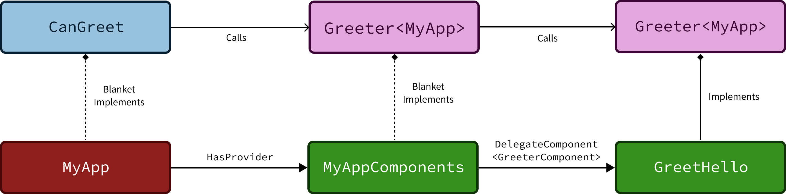
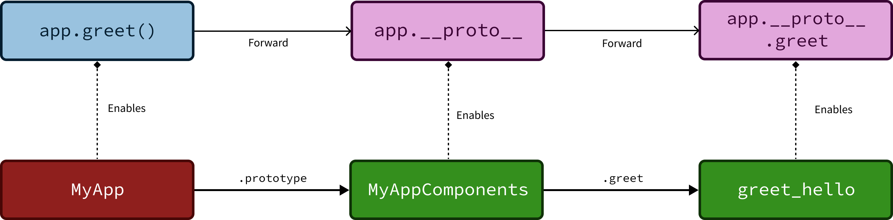
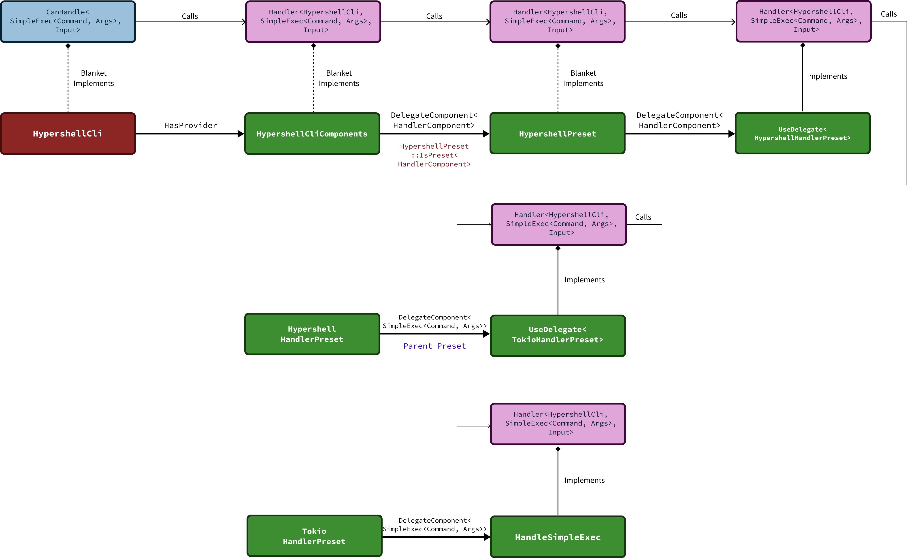

I am thrilled to introduce [**Hypershell**](https://github.com/contextgeneric/hypershell), a modular, *type-level* domain-specific language (DSL) for writing shell-script-like programs in Rust. Hypershell is powered by [**context-generic programming**](/) (CGP), which makes it possible for users to *extend* or *modify* both the language syntax and semantics.

<!-- truncate -->

## Discussion

Discuss on [Reddit](https://www.reddit.com/r/rust/comments/1lb296n/announcing_hypershell_a_typelevel_dsl_for/), [Lobsters](https://lobste.rs/s/1swikb/hypershell_type_level_dsl_for_shell), and [Hacker News](https://news.ycombinator.com/item?id=44274767).

## Table of Contents

**Estimated reading time:** 1~2 hours (≈16 500 words).

This is a very long blog post, so I have included this section to give you an overview of the content, and know what to expect for each section.

The first section, [**An Overview of Hypershell**](#an-overview-of-hypershell), gives a high level overview of the Hypershell DSL, together with example programs that we can write with it.

Next, [**Context-Generic Programming**](#context-generic-programming) gives a quick tour on the high level concepts of CGP, so that readers who are new to CGP can quickly onboard to understanding the rest of the blog post.

Following that, [**Implementation of Hypershell**](#implementation-of-hypershell) goes into the details of how Hypershell is implemented using CGP.

After that, [**Extending Hypershell**](#extending-hypershell) walks through how CGP makes it possible to easily extend Hypershell with new language features.

Finally, [**Discussions**](#discussions) talks about the work related to Hypershell, the pros and cons of our DSL approach, and how readers can get involved or support the project.

## Disclaimer

Hypershell serves as an _experimental_ proof of concept, showcasing the capabilities of CGP. As such, its primary purpose is to demonstrate how CGP can be used to build highly modular DSLs in Rust.

The example use case of shell scripting is primarily chosen because it is fun and approachable to programmers of all backgrounds. But regardless of the future outcome, I hope Hypershell can serve as a _fun_ programming example and inspire you to become interested in learning CGP.

# An Overview of Hypershell

## Getting Started

You can use Hypershell today by simply adding the `hypershell` crate to your `Cargo.toml` dependencies. Since we will also cover the direct use of CGP, you should also add the `cgp` crate to your dependencies.

```toml
[dependencies]
cgp         = { version = "0.4.1" }
hypershell  = { version = "0.1.0" }
```

## Hello World

We will begin learning Hypershell with a simple hello world example. Our hello world program runs the CLI command `echo hello world!` and then streams the output to `STDOUT`. With Hypershell, our program is written as follows:

```rust
use hypershell::prelude::*;

pub type Program = hypershell! {
        SimpleExec<
            StaticArg<"echo">,
            WithStaticArgs["hello", "world!"],
        >
    |   StreamToStdout
};
```

We first import everything from `hypershell::prelude` to use common Hypershell constructs. Our hello program is then defined as a Rust *type* named `Program`. In the body, we use the `hypershell!` macro to define our program with shell-like syntactic sugar, such as the use of the pipe operator (`|`). At a high level, a Hypershell program consists of one or more *handlers* that form a connected *pipeline*.

In the first part of the program, we use the `SimpleExec` handler to perform a simplified execution of a CLI command. The first argument to `SimpleExec` is `StaticArg<"echo">`, meaning that the program always executes the hardcoded `echo` command. The second argument to `SimpleExec` is `WithStaticArgs`, which accepts a *variadic* list of static arguments that are passed to the `echo` command.

In the second part of the program, we use the `|` operator to indicate that we want to pipe the result from `SimpleExec` to the next handler, `StreamToStdout`. The `StreamToStdout` handler then streams the output to the `STDOUT` of the main Rust program so that we can see the output when running the program.

Now that our program is defined, we can define a `main` function to call the Hypershell program inside our Rust program:

```rust
#[tokio::main]
async fn main() -> Result<(), Error> {
    HypershellCli
        .handle(PhantomData::<Program>, Vec::new())
        .await?;

    Ok(())
}
```

We use `#[tokio::main]` to define an async main function. Inside the function body, we make use of `HypershellCli`, which is a pre-defined context that can be used for running simple CLI-only Hypershell programs. The `HypershellCli` context is an empty struct, hence we are able to directly construct a value and call the `handle` method on it.

The `handle` method comes from the `CanHandle` trait from `cgp`, and is automatically implemented by `HypershellCli` for any supported program. This blanket implementation is a key enabler of CGP's modularity, allowing `HypershellCli` to handle diverse Hypershell programs without explicit implementations for each. We pass our program to the first argument of `handle` as `PhantomData::<Program>`, that is, the `Program` we defined earlier is purely a *type-level* construct and has no meaningful representation at the value-level. Nevertheless, we use `PhantomData` to "pass" the type as a value parameter, as this leads to cleaner syntax compared to passing it as a generic argument.

We then pass an empty `Vec<u8>` to the second argument of `handle`; this `Vec<u8>` serves as the `STDIN` input for the executed command. In this specific `echo` example, it remains empty as `echo` operates directly on its arguments rather than `STDIN`.

The full example program shown here is also available at our [GitHub repository](https://github.com/contextgeneric/hypershell/blob/main/crates/hypershell-examples/examples/hello.rs). If you clone the repository, you can run the example program with `cargo run`, and we should see the familiar `hello world!` printed out:

```bash
$ cargo run --example hello
hello world!
```

## Macro Desugaring

The `hypershell!` macro is a straightforward procedural macro that performs basic syntax transformations, making Hypershell programs resemble shell scripts. However, its use is entirely **optional**; you can define Hypershell programs without it.

For instance, the previous "hello world" program can be rewritten as follows:

```rust
pub type Program = Pipe<Product![
    SimpleExec<
        StaticArg<Symbol!("echo")>,
        WithStaticArgs<Product![
            Symbol!("hello"),
            Symbol!("world!"),
        ]>,
    >,
    StreamToStdout,
]>;
```

Compared to the "prettified" version, the raw Hypershell syntax is slightly more verbose but remains relatively readable. The first thing to notice is that handlers chained with `|` are now placed inside a **`Pipe`** wrapper. Furthermore, the **`Product!`** macro from CGP is used to construct a variable-length list at the _type-level_, enabling `Pipe` to accept an arbitrary number of handlers.

You can also see that the `WithStaticArgs[...]` syntax **desugars** to `WithStaticArgs<Product![...]>.` With `hypershell!`, syntax that accepts a variable number of arguments can use the `[]` shorthand to wrap the inner arguments within `Product!`. This results in cleaner, more concise syntax, making Hypershell programs more readable.

Finally, you might notice that all occurrences of strings are wrapped inside the **`Symbol!`** macro from CGP. This is because Hypershell programs are types, but string literals are value-level expressions. The `Symbol!` macro allows you to turn string literals into _types_, enabling their use within type expressions.

Behind the scenes, `Symbol!` functions similarly to **const-generics** in Rust. However, since Rust doesn't yet support using `String` or `&str` as const-generic arguments, the macro desugars the string literal into a type-level list of `char`, which *can* be used with const-generics.

With these three syntax transformations, we can now better understand how the `hypershell!` macro works. In Hypershell's DSL architecture, the `hypershell!` macro provides the _surface syntax_ of the DSL, which is then desugared into Rust types that serve as the _abstract syntax_.

## Variable Parameters

Now that we have a better understanding of Hypershell, let's move on to a slightly more complex "hello world" example. Suppose we want to run `echo` with a _variable_ argument `name`, so that the program prints "Hello", followed by the value stored in `name`. To do that, we would redefine our program as follows:

```rust
pub type Program = hypershell! {
        SimpleExec<
            StaticArg<"echo">,
            WithArgs [
                StaticArg<"Hello">,
                FieldArg<"name">,
            ],
        >
    |   StreamToStdout
};
```

In our new program, the second argument to `SimpleExec` is changed from `WithStaticArgs` to `WithArgs`. The main difference is that `WithStaticArgs` accepts a list of static arguments, while `WithArgs` accepts a list of arguments with explicit specifiers.

For the first argument within `WithArgs`, we specify `StaticArg<"Hello">` to indicate that the string `"Hello"` should always be printed as the first argument. Following that, we specify `FieldArg<"name">` to indicate that the value of the `name` field from the context should be used as the second argument.

Now that we have defined our program, a question that arises next is: how can we "pass" in the `name` value to the program? Given that the program itself is only present at the type level, there is no place to hold the `name` value directly *within* the program type. If we try to run the program using `HypershellCli`, we will encounter errors indicating that no `name` field is present within the `HypershellCli` context.

### Custom Context

To resolve the problem of variable capture, we'll define a **new context type** for running our program. We'll define a `MyApp` context with a `name` field as follows:

```rust
#[cgp_context(MyAppComponents: HypershellPreset)]
#[derive(HasField)]
pub struct MyApp {
    pub name: String,
}
```

The `MyApp` context is a straightforward struct with a public `name` field of type `String`. What makes it special are the two attribute macros used to automatically derive the capabilities needed for running Hypershell programs.

The first macro, `#[cgp_context]`, enables the wiring of CGP components for use by this context. The argument `MyAppComponents` is the name given to the **provider** for the `MyApp` context. For this example, we can largely disregard it as we're not including any additional component wiring.

The macro argument is followed by a colon and then `HypershellPreset`, indicating that the `MyAppComponents` provider **inherits** from `HypershellPreset`, which Hypershell provides. This syntax might remind you of Rust's supertraits, operating somewhat like object-oriented prototypal inheritance but exclusively at compile-time and the **type-level**.

For the purpose of this example, the key takeaway is that the `MyApp` context implements all supported Hypershell components through its `MyAppComponents` provider, with the component wiring inherited from `HypershellPreset`. We'll explore how CGP presets are defined and customized later in this blog post.

The second macro, `#[derive(HasField)]`, automatically implements the `HasField` trait for `MyApp`. This macro exposes the `name` field in `MyApp` via a `HasField` implementation, making it accessible by the `FieldArg<"name">` in our Hypershell program.

Now that our custom context is defined, we can construct an instance of it within our `main` function and use it to execute our program:

```rust
#[tokio::main]
async fn main() -> Result<(), Error> {
    let app = MyApp {
        name: "Alice".to_owned(),
    };

    app.handle(PhantomData::<Program>, Vec::new()).await?;
    Ok(())
}
```

The complete example is available in the [Hypershell repository](https://github.com/contextgeneric/hypershell/blob/main/crates/hypershell-examples/examples/hello_name.rs). Since we initialize the `MyApp` context with the value `"Alice"` set in the `name` field, running the program should print `"Hello, Alice"`:

```bash
$ cargo run --example hello_name
Hello, Alice
```

## Context-Generic Implementation

The previous example demonstrates that our custom `MyApp` context implements all the same functionalities as `HypershellCli` with only two lines of macro code. This remarkable conciseness is entirely due to Hypershell's core implementation being fully **context-generic**. Crucially, none of Hypershell's underlying implementation code has direct access to specific concrete types like `HypershellCli` or `MyApp`.

Since the Hypershell core implementation lacks direct access to concrete contexts, it's designed to be **generic** over any context type that satisfies predefined conditions. This approach makes Hypershell's implementation highly customizable and extensible. CGP makes it incredibly **easy** to define custom contexts like `MyApp`, effectively eliminating tight coupling between implementations and concrete types.

As a side note, if you're curious, the `#[cgp_context]` macro **does not** generate Hypershell implementation code specifically for `MyApp`. Instead, if you expand the macro, you'll find it generates only a few lines of trait implementations that link to the `HypershellPreset` provider.

This design puts CGP in stark contrast with alternative modular programming libraries in Rust, which often rely on heavy macro expansion to copy "template" code implementations to work with concrete types. In contrast, CGP leverages Rust's powerful traits, generics, and type system to ensure that all abstract implementations reliably function regardless of the concrete types they are instantiated with.

## Dependency Injection

A key feature CGP provides, leveraging Rust's capabilities, is **dependency injection** within context-generic implementations. Even though Hypershell's core implementation is generic over the context type, we can introduce additional trait bounds in `impl` blocks to impose specific constraints on that context.

The implementation for `FieldArg<"name">` exemplifies this by requiring the generic context to contain a `name` field. Because `MyApp` exposes its `name` field via the `HasField` instance, `FieldArg<"name">` automatically works with `MyApp`. Conversely, attempting to use it with `HypershellCli` would result in a compilation error, as `HypershellCli` lacks the required `name` field.

From this, we also learn that CGP's implementation wiring is performed **lazily**. Both `HypershellCli` and `MyApp` are wired with the same abstract implementations from `HypershellPreset`. However, only *some* of these wirings are valid, depending on the additional capabilities provided by the concrete context.

While it has always been possible to use dependency injection through Rust trait `impl`s, even in vanilla Rust, CGP elevates this pattern. It enables powerful use cases like the flexible implementation of `FieldArg` demonstrated in this example, pushing the boundaries of what's achievable with dependency injection in Rust.

## Streaming Handlers

Now that we've covered the basics of Hypershell, let's dive into defining more complex Hypershell programs. In our earlier examples, we executed CLI commands using `SimpleExec`, which handles inputs and outputs as raw bytes (`Vec<u8>`). This execution mode offers simpler semantics, as you don't need to worry about prematurely closed `STDIN` or `STDOUT` streams.

However, a significant appeal of shell scripting is the ability to **stream** the `STDOUT` of one program directly into the `STDIN` of another, with both programs running in parallel. To support this, Hypershell provides **`StreamingExec`**, which spawns child processes in the background and manages inputs and outputs as **streams**. Hypershell currently supports three types of streams: [`futures::Stream`](https://docs.rs/futures/latest/futures/prelude/trait.Stream.html), [`futures::AsyncRead`](https://docs.rs/futures/latest/futures/io/trait.AsyncRead.html), and [`tokio::io::AsyncRead`](https://docs.rs/tokio/latest/tokio/io/trait.AsyncRead.html). As we'll see later, Hypershell's modular design also simplifies extending implementations to support other stream types.

To demonstrate streaming execution, let's define an example program that streams the HTTP response from a URL and computes the SHA256 checksum of the webpage. Our program would look like this:

```rust
pub type Program = hypershell! {
    StreamingExec<
        StaticArg<"curl">,
        WithArgs [
            FieldArg<"url">,
        ],
    >
    |   StreamingExec<
            StaticArg<"sha256sum">,
            WithStaticArgs [],
        >
    |   StreamingExec<
            StaticArg<"cut">,
            WithStaticArgs [
                "-d",
                " ",
                "-f",
                "1",
            ],
        >
    |   StreamToStdout
};
```

Simply put, the Hypershell program above is roughly equivalent to the following bash command:

```bash
curl $url | sha256sum | cut -d ' ' -f 1
```

The first handler uses `curl` to fetch the HTTP response from a `url` value provided by the context. The second handler uses `sha256sum` to perform a streaming computation of the checksum. The third handler then uses `cut` to extract only the checksum value produced by `sha256sum`, effectively ignoring the filename output in the second column.

As in the previous example, we'll define a new `MyApp` context to provide the `url` value:

```rust
#[cgp_context(MyAppComponents: HypershellPreset)]
#[derive(HasField)]
pub struct MyApp {
    pub url: String,
}
```

We can then call the program with our `MyApp` context in the `main` function:

```rust
#[tokio::main]
async fn main() -> Result<(), Error> {
    let app = MyApp {
        url: "https://nixos.org/manual/nixpkgs/unstable/".to_owned(),
    };

    app.handle(PhantomData::<Program>, Vec::new()).await?;

    Ok(())
}
```

For this example, we've chosen a relatively large public webpage — the [Nix manual](https://nixos.org/manual/nixpkgs/unstable/) — as the `url` value for `MyApp`, to make the effect of streaming more noticeable.

The complete example program is also available in the [Hypershell repository](https://github.com/contextgeneric/hypershell/blob/main/crates/hypershell-examples/examples/http_checksum_cli.rs). If you run it, you should see a checksum similar to this printed to your console:

```bash
$ cargo run --example http_checksum_cli
c5ce4ff8fb2d768d4cbba8f5bee3d910c527deedec063a0aa436f4ae7005c713
```

Feel free to tweak the example with different CLI commands to better observe how Hypershell indeed streams handler inputs and outputs in parallel.

## Native HTTP Request

In our previous example, we performed HTTP requests using the `curl` command before piping the output to `sha256sum`. But since we're already running our program in Rust, a natural progression is to use *native* Rust HTTP clients for these requests.

Hypershell offers native HTTP support as a separate **extension** built on top of its base CLI implementation. This extension provides the `SimpleHttpRequest` and `StreamingHttpRequest` handlers, which are the HTTP equivalents of `SimpleExec` and `StreamingExec`.

We can easily modify our earlier example to use `StreamingHttpRequest` instead of `curl`:

```rust
pub type Program = hypershell! {
    StreamingHttpRequest<
        GetMethod,
        FieldArg<"url">,
        WithHeaders[ ],
    >
    |   StreamingExec<
            StaticArg<"sha256sum">,
            WithStaticArgs [],
        >
    |   StreamingExec<
            StaticArg<"cut">,
            WithStaticArgs [
                "-d",
                " ",
                "-f",
                "1",
            ],
        >
    | StreamToStdout
};
```

The `StreamingHttpRequest` handler accepts three arguments. The first, `GetMethod`, specifies that we want to send a `GET` HTTP request. The second argument, `FieldArg<"url">`, indicates that the request should be sent to the URL provided by the `url` field in our context. The third argument, `WithHeaders[]`, allows us to specify HTTP headers, which we've left empty for this example.

As you can see, Hypershell allows you to build seamless streaming pipelines that integrate both native and CLI handlers. In fact, all handlers are simply CGP components that implement the `Handler` interface. This design makes it incredibly easy to extend the DSL with new handler implementations that can interoperate, as long as the Rust types for their inputs and outputs match.

Behind the scenes, Hypershell's native HTTP client is implemented using [`reqwest`](https://docs.rs/reqwest/). To run the program, the context needs to provide an `http_client` field containing a [`reqwest::Client`](https://docs.rs/reqwest/latest/reqwest/struct.Client.html) instance.

Combining this with the `url` field, we'll define our `MyApp` context like so:

```rust
#[cgp_context(MyAppComponents: HypershellPreset)]
#[derive(HasField)]
pub struct MyApp {
    pub http_client: Client,
    pub url: String,
}
```

We can then construct a `MyApp` context in our `main` function and call the Hypershell program:

```rust
#[tokio::main]
async fn main() -> Result<(), Error> {
    let app = MyApp {
        http_client: Client::new(),
        url: "https://nixos.org/manual/nixpkgs/unstable/".to_owned(),
    };

    app.handle(PhantomData::<Program>, Vec::new()).await?;
    Ok(())
}
```

The full example is available in the [project repository](https://github.com/contextgeneric/hypershell/blob/main/crates/hypershell-examples/examples/http_checksum_client.rs). Running it should produce the same HTTP checksum as before:

```bash
$ cargo run --example http_checksum_client
c5ce4ff8fb2d768d4cbba8f5bee3d910c527deedec063a0aa436f4ae7005c713
```

It's also worth noting that, besides `reqwest`, it's possible to customize a context to use alternative HTTP client implementations for `SimpleHttpRequest` and `StreamingHttpRequest`. In such cases, you could define contexts without the `http_client` field if your alternative implementation doesn't require it.

## JSON Encoding

As an embedded DSL, Hypershell programs seamlessly integrate shell scripting with the rest of your Rust application. A prime example of this capability is the ability to encode and decode native Rust types as part of a Hypershell program's pipeline.

Here's an example Hypershell program that submits a Rust code snippet to the [Rust Playground](https://play.rust-lang.org/) and then publishes it as a GitHub Gist:

```rust
pub type Program = hypershell! {
    EncodeJson
    |   SimpleHttpRequest<
            PostMethod,
            StaticArg<"https://play.rust-lang.org/meta/gist">,
            WithHeaders [
                Header<
                    StaticArg<"Content-Type">,
                    StaticArg<"application/json">,
                >
            ],
        >
    |   DecodeJson<Response>
};
```

The **`EncodeJson`** handler accepts any input that implements `Serialize` and encodes it into JSON bytes as its output. Next, we use **`SimpleHttpRequest`** to submit the HTTP request; streaming isn't necessary for small payloads here. Within `WithHeaders`, we also use `Header` to set the `Content-Type` header to `application/json`. Finally, the **`DecodeJson`** handler decodes its input bytes into the specified Rust type, which is expected to implement `Deserialize`.

We define the input and output types as follows:

```rust
#[derive(Serialize)]
pub struct Request {
    pub code: String,
}

#[derive(Debug, Deserialize)]
pub struct Response {
    pub id: String,
    pub url: String,
    pub code: String,
}
```

The `Request` and `Response` types are defined with their respective `Serialize` and `Deserialize` implementations, adhering to the formats expected by the Rust Playground API.

With the program defined, we can now programmatically submit a code snippet to the Rust Playground in our `main` function:

```rust
#[tokio::main]
async fn main() -> Result<(), Error> {
    let app = HypershellHttp {
        http_client: Client::new(),
    };

    let input = Request {
        code: "fn main() { println!(\"Hello, world!\"); }".to_owned(),
    };

    let output = app.handle(PhantomData::<Program>, input).await?;

    println!("Created new Rust playground gist with response: {output:#?}");

    Ok(())
}
```

When no additional fields are required, Hypershell provides the predefined **`HypershellHttp`** context, which can be used to run Hypershell programs with HTTP capabilities. This example code is also available in the [project repository](https://github.com/contextgeneric/hypershell/blob/main/crates/hypershell-examples/examples/rust_playground.rs). Running it should produce an output similar to this:

```bash
$ cargo run --example rust_playground
Created new Rust playground gist with response: Response {
    id: "ec90cbb6b3e797b15dd1eacbd51ffa8b",
    url: "https://gist.github.com/rust-play/ec90cbb6b3e797b15dd1eacbd51ffa8b",
    code: "fn main() { println!(\"Hello, world!\"); }",
}
```

## End of Overview

By now, hopefully the preceding examples have sufficiently demonstrated the power of Hypershell's base implementation, suggesting its potential utility in building real-world™ applications.

Now that I've piqued your interest, I hope these examples have also provided you with ample motivation to learn _how_ Hypershell is implemented, and how you can leverage CGP to build other domain-specific languages in a similar fashion.

# Context-Generic Programming

At its core, Hypershell's modular implementation is made possible by **Context-Generic Programming (CGP)**, a powerful modular programming paradigm for Rust. You can find a comprehensive introduction to CGP on the [website](/) that hosts this blog post. However, for those new to CGP, I'll provide a brief overview in this section.

As its name suggests, CGP allows Hypershell's core logic to be generic over *any* context type, such as `HypershellCli`, `HypershellHttp`, or `MyApp`. This means that whenever you define a new concrete context, you can choose to reuse **all**, or more importantly, **some** of Hypershell's core implementation based on your application's specific needs. Furthermore, external developers can write their own context-generic implementations in the same way, enabling them to **replace** or **extend** existing core implementations.

At a high level, CGP makes it possible to bypass Rust's trait **coherence restrictions**, allowing you to define overlapping or "orphan" trait implementations. Everything else in CGP is built on the foundation of asking: what would Rust programs look like if there were no coherence restrictions? CGP works on **safe, stable** versions of Rust today, and all you need to do is include the [`cgp`](https://crates.io/crates/cgp) crate as a dependency.

## Consumer and Provider Traits

The basic idea of how CGP works around coherence is quite simple. Let's start with an example `CanGreet` trait, implemented with CGP as follows:

```rust
use cgp::prelude::*;

#[cgp_component(Greeter)]
pub trait CanGreet {
    fn greet(&self);
}
```

The `CanGreet` trait we've defined is a classical Rust trait, which we refer to as a **consumer trait** in CGP. With the `#[cgp_component]` macro, a **provider trait** and a **name struct** are also generated, as shown below:

```rust
pub trait Greeter<Context> {
    fn greet(context: &Context);
}

pub struct GreeterComponent;
```

Compared to the `CanGreet` consumer trait, the `Greeter` provider trait has an additional generic `Context` parameter that refers to the original `Self` type from `CanGreet`. Similarly, all occurrences of `Self` (i.e., `&self`) are replaced with the explicit `Context` (i.e., `context: &Context`).

In CGP, each implementation of a provider trait like `Greeter` will choose a **unique type** for its `Self` parameter (e.g., by defining a dummy struct like `struct Provider;`). This dummy struct that implements the provider trait is called a **provider**. Because Rust's coherence restriction primarily applies to the `Self` type, by choosing a unique `Self` type for each implementation, we effectively bypass these restrictions. This allows us to define multiple generic implementations that might otherwise overlap on the `Context` type.

The macro also generates a `GreeterComponent` struct. This struct serves as a **name** or **key** for the underlying implementation, used to perform a type-level **lookup** when instantiating the consumer trait's implementation from a provider trait implementation. We'll revisit this concept shortly.

To demonstrate, here are two example provider implementations for `Greeter`:

```rust
#[cgp_new_provider]
impl<Context> Greeter<Context> for GreetHello {
    fn greet(context: &Context) {
        println!("Hello!");
    }
}

#[cgp_new_provider]
impl<Context> Greeter<Context> for GreetBonjour {
    fn greet(context: &Context) {
        println!("Bonjour!");
    }
}
```

The `#[cgp_new_provider]` macro automatically defines new structs for `GreetHello` and `GreetBonjour`. As you can see, both implementations are generic over the `Context` type, and no errors arise from overlapping instances.

## Components Wiring

While multiple overlapping provider trait implementations can coexist, they don't automatically implement the original consumer trait like `CanGreet`. To implement the consumer trait for a specific concrete context, **additional wiring steps** are needed to select *which* provider implementation should be used for that context.

To demonstrate how this wiring works, let's define an example `MyApp` context:

```rust
#[cgp_context(MyAppComponents)]
pub struct MyApp;

delegate_components! {
    MyAppComponents {
        GreeterComponent: GreetHello,
    }
}
```

In this example, we define a concrete `MyApp` context using the `#[cgp_context]` macro, which generates a new `MyAppComponents` struct and associates it with the context. Following this, we use `delegate_components!` to effectively make `MyAppComponents` a **type-level lookup table**. This table contains one entry where `GreeterComponent` acts as the "key" and `GreetHello` is the "value."

With this wiring in place, the concrete `MyApp` context now automatically implements `CanGreet`, allowing us to call `MyApp.greet()`. To understand how this "magic" happens, let's visualize the underlying implementation:



Starting from the bottom left, our goal is to implement `CanGreet` for `MyApp`. First, the Rust trait system observes that `MyApp` lacks an explicit `CanGreet` implementation. However, it *does* have a `HasProvider` implementation generated by `#[cgp_context]`, which points to `MyAppComponents`.

Next, the trait system sees that `MyAppComponents` doesn't directly implement `Greeter<MyApp>`. So, the system performs a type-level lookup using the `GreeterComponent` key stored in `MyAppComponents`. This lookup is facilitated by the `DelegateComponent<GreeterComponent>` trait, which is generated by the `delegate_components!` macro. Here, it discovers an entry for `GreeterComponent` that points to `GreetHello`.

Subsequently, the trait system confirms that `GreetHello` has a valid implementation of `Greeter<MyApp>`. Through this, it generates a blanket implementation of `Greeter<MyApp>` for `MyAppComponents`, which simply forwards the call to `GreetHello`.

Similarly, now that `Greeter<MyApp>` is implemented for `MyAppComponents`, the trait system generates a blanket implementation of `CanGreet` for `MyApp`. This blanket implementation forwards the call to the `Greeter<MyApp>` implementation of `MyAppComponents`, which in turn forwards it to `GreetHello`.

These blanket implementations for `CanGreet` and `Greeter` were generated by `#[cgp_components]` when the consumer trait was defined. What we've described above is a high-level visualization of how these blanket implementations function under the hood.

## Prototypal Inheritance

For readers familiar with JavaScript, you might notice that CGP's wiring mechanics bear a striking resemblance to how **prototypal inheritance** works in JavaScript. Conceptually, our earlier `greet` example functions similarly to the following JavaScript code:

```javascript
// provider
function greet_hello() {
    console.log("Hello!")
}

// lookup table
var MyAppComponents = {
    greet: greet_hello,
}

// concrete context
var MyApp = function() {}
MyApp.prototype = MyAppComponents

// context value
var app = new MyApp()
app.greet()
```

Since JavaScript is dynamically typed, the concept of a trait or interface can't be explicitly specified in the code. However, we can still *conceptually* think of a `CanGreet` interface with certain method requirements. The `greet_hello` function here is the equivalent of a **provider** that implements the imaginary `Greeter` interface.

Similarly, `MyAppComponents` acts as a lookup table, mapping the `greet` method to the `greet_hello` provider. We then define the `MyApp` context class and set `MyAppComponents` as `MyApp`'s **prototype**. This mirrors CGP's `HasProvider` trait, which links the consumer trait implementation to the provider trait.

Finally, we can instantiate `MyApp` using the `new` keyword, and as expected, the `app.greet()` method can be called.

If we visualize the prototype wiring in our JavaScript example, we get a diagram very similar to the one for CGP:



We navigate this implementation diagram starting from the top-left corner. For `app.greet()` to be implemented, its class `MyApp` needs a `prototype` field pointing to `MyAppComponents`. We then perform a lookup on the `greet` key and find the `greet_hello` provider function to be called.

During runtime, the `MyAppComponents` prototype is attached to `app.__proto__`, which in turn enables `app.greet()` to be called.

## Comparison to OOP

While CGP shares similarities with OOP, particularly prototype-based programming, its implementation differs significantly in ways that make CGP a far more powerful system.

Crucially, Rust's strong type system, combined with advanced features like generics and traits, enables the creation of highly sophisticated constructs that are simply not possible with OOP alone. Furthermore, CGP performs its prototype-like lookup at **compile-time**, thereby eliminating runtime overheads associated with virtual tables and JIT compilation.

Through this comparison, I also hope to convey that CGP is **not** an entirely novel or incomprehensible concept. Many resources explain prototypal inheritance in depth, but there are virtually no third-party articles detailing how CGP works. My intention with this similarity comparison is to help readers from an OOP background better grasp CGP by connecting it to familiar concepts.

## Learn More

We've now concluded our brief introduction to CGP. So far, we've explored CGP at a high level, with minimal technical details or code exploration into its inner workings.

If you're eager to learn more about how CGP functions, I recommend reading the in-progress book, [**Context-Generic Programming Patterns**](https://patterns.contextgeneric.dev/). This book walks through all the programming techniques used to build CGP from the ground up. However, if you're not concerned with the internal details and simply want to start programming *with* CGP quickly, you might want to skip the book for now.

Unfortunately, we don't yet have simple tutorials available for quickly getting started with CGP. This is partly because the benefits of CGP truly become apparent only in highly complex applications with many cross-cutting concerns, typically after writing 5,000 to 10,000 lines of code. Consequently, if a tutorial only showcases a few hundred lines of example code, some readers might inevitably feel confused about *why* they should learn to write that code with CGP, rather than using familiar vanilla Rust patterns.

Instead, the current priority for the CGP project is to leverage its full power to build robust DSL frameworks, such as Hypershell. These frameworks aim to demonstrate CGP's full potential and undeniable usefulness in showcased domains, thereby giving readers a compelling reason to start *learning* CGP.

A consequence of this strategy is that many advanced CGP patterns are introduced all at once, as you'll see in the next section. Many of these advanced CGP patterns aren't yet covered in the book, and currently, there's no other documentation besides this blog post that discusses them. As a result, if you're entirely new to CGP or just starting to grasp its basic concepts, continuing to the next section might feel overwhelming and confusing.

Nevertheless, I'll strive to explain these advanced CGP concepts at as high a level as possible, omitting internal details similar to how the earlier CGP wiring explanation was presented. So, I hope you'll bear with me for now as we walk through how Hypershell is implemented with CGP.

# Implementation of Hypershell

Now that we have a brief understanding of CGP, let's explore how the Hypershell DSL is implemented using it. The programming techniques we're about to cover aren't exclusive to Hypershell; they apply more generally to any kind of DSL.

The core idea is that programs for this family of DSLs are written as **types** that are "interpreted" at compile time. The primary advantage of this approach is that the DSL can leverage the Rust compiler and zero-cost abstractions to be highly performant. The main drawback is that the DSL program must be available at the same time the Rust program is built. In other words, this approach is less suitable for scripting applications that require dynamic program loading, such as web browsers or plugin systems, unless the system also bundles the full Rust compiler to compile the DSL program.

Nevertheless, this section will be especially useful for readers interested in building DSLs similar to Hypershell. For other readers, I hope this section will still enhance your understanding of CGP and encourage you to consider using it for other modular applications.

## Handler Component

The central component underpinning Hypershell is the **`Handler`** component, which is implemented by each handler in a Hypershell pipeline. The consumer trait for this component, **`CanHandle`**, is defined as follows:

```rust
#[cgp_component(Handler)]
pub trait CanHandle<Code: Send, Input: Send>: HasAsyncErrorType {
    type Output: Send;

    async fn handle(
        &self,
        _code: PhantomData<Code>,
        input: Input,
    ) -> Result<Self::Output, Self::Error>;
}
```

The `CanHandle` trait is parameterized by two generic types: `Code` and `Input`. The `Code` type represents the DSL program that we want to "run" or "interpret," while `Input` is the primary input data passed to the program (e.g., `STDIN` or an HTTP request body). Both generic types carry an additional `Send` bound because CGP generally requires async functions to be `Send` by default, allowing them to be used in spawned tasks like those managed by `tokio::spawn`.

The trait also defines an associated type `Output`, which represents the data produced by the program (e.g., `STDOUT` or an HTTP response body). As an associated type, it signifies that for each unique combination of `Code` and `Input` parameters, there is a **unique** `Output` type associated with it.

The `handle` method is an `async` function with `&self` as its first argument. This means that in addition to the `Input`, the handler also has access to the context, which contains dependencies and environmental information. The second parameter, `_code`, is of type `PhantomData<Code>`. This is used to pass the `Code` program as a value to assist with type inference. Beyond that, the `_code` value is expected to be ignored by the method body, as `PhantomData` carries no runtime information.

The `handle` method returns a `Result`, with `Self::Output` representing the success value and `Self::Error` indicating an error. `Self::Error` is an **abstract type** defined by the `ErrorTypeProvider` component, which is defined in CGP as follows:

```rust
#[cgp_type]
pub trait HasErrorType {
    type Error: Debug;
}
```

First, `HasErrorType` is a consumer trait containing an associated `Error` type, which is always required to implement `Debug`. The `#[cgp_type]` macro is an *extension* of `#[cgp_component]`, used to define abstract type components with additional derivations. This macro also generates an `ErrorTypeProvider` provider trait.

To support the `async` method in `CanHandle`, the context and the `Error` type also need to implement `Send`. This is provided by `HasAsyncErrorType` as a **trait alias**:

```rust
#[blanket_trait]
pub trait HasAsyncErrorType:
    Send + Sync + HasErrorType<Error: Send + Sync>
{}
```

The `HasAsyncErrorType` trait is automatically implemented for any `Context` type that implements `HasErrorType`, with the additional constraints that `Context: Send + Sync` and `Context::Error: Send + Sync`. This ensures that the `Future` returned by `async` functions that capture `Context` or `Context::Error` will always implement `Send`.

The `#[blanket_trait]` macro is provided by CGP to shorten trait alias definitions. Behind the scenes, it generates a trivial blanket implementation for `HasAsyncErrorType` that is activated if all supertrait constraints are satisfied.

Returning to `CanHandle`, the `#[cgp_component]` macro also generates the provider trait `Handler` as follows:

```rust
pub trait Handler<Context, Code: Send, Input: Send>
where
    Context: HasAsyncErrorType,
{
    type Output: Send;

    async fn handle(
        context: &Context,
        _tag: PhantomData<Code>,
        input: Input,
    ) -> Result<Self::Output, Context::Error>;
}
```

As we can see, the main difference between `Handler` and `CanHandle` is that the `Self` type in `CanHandle` is replaced with an explicit `Context` parameter in `Handler`. The supertrait `HasAsyncErrorType` now becomes a trait bound for `Context`.

## Abstract Syntax

Now that we understand the interface for the handler component, let's look at how the `Handler` trait is implemented for a basic Hypershell code: `SimpleExec`. As you might recall, `SimpleExec` allows the execution of shell commands, using raw bytes for both input and output.

If you navigate to the definition of `SimpleExec`, all you'll find is this:

```rust
pub struct SimpleExec<CommandPath, Args>(pub PhantomData<(CommandPath, Args)>);
```

*Wait, what?* Is that it? Yes, you read that right. There are no extra trait implementations directly tied to `SimpleExec`. In fact, all types used to "write" a Hypershell program are just dummy structs like this one.

**This implies that how a Hypershell program is "written" is completely _decoupled_ from how the program is "interpreted" or "executed" by a concrete context.**

In other words, when we explored our examples earlier, `HypershellCli`, `HypershellHttp`, or `MyApp` were just a few of the possible **choices** you could make to run your Hypershell programs. More generally, since all these contexts so far only inherit from `HypershellPreset`, it means you can also build fully customized presets with different ways to run the programs — for example, by changing how `SimpleExec` should behave.

More formally, a type like `SimpleExec` represents the **abstract syntax** of the Hypershell DSL. We then leverage CGP and Rust's trait system to act as the "interpreter" for the DSL, dispatching the handling of a program fragment to a specific CGP provider. When you define custom contexts, you're essentially building custom "interpreters" used for "executing" the Hypershell program at compile time.

It's also worth noting that the pattern introduced here is a highly advanced CGP programming technique. Simpler versions of this pattern exist, such as **higher-order providers**, where traits like `Handler` wouldn't contain the `Code` parameter, and types like `SimpleExec` would directly implement the `Handler` trait. In this simplified pattern, the program's execution would be tightly coupled with a specific implementation, making it less modular.

Both higher-order providers and the DSL patterns are advanced CGP techniques not yet covered in the CGP patterns book. While such advanced techniques can sometimes be overkill for building simple applications — especially for beginners just trying to make their applications *slightly* more modular — they are perfect for building DSLs. This is because it's good practice to separate the **syntax** from the **semantics** of programming languages.

## Handler Implementation for `SimpleExec`

For many new to CGP, it's likely unclear how to even begin finding the actual implementation for `SimpleExec` at this point. We'll delve into the wiring specifics later. For now, let's jump straight to the default provider Hypershell uses to implement `SimpleExec`:

```rust
#[cgp_new_provider]
impl<Context, CommandPath, Args, Input>
    Handler<Context, SimpleExec<CommandPath, Args>, Input>
    for HandleSimpleExec
where
    Context: CanExtractCommandArg<CommandPath>
        + CanUpdateCommand<Args>
        + CanRaiseAsyncError<std::io::Error>
        + for<'a> CanWrapAsyncError<CommandNotFound<'a>>
        + ...,
    Context::CommandArg: AsRef<OsStr> + Send,
    CommandPath: Send,
    Args: Send,
    Input: Send + AsRef<[u8]>,
{
    type Output = Vec<u8>;

    async fn handle(
        context: &Context,
        _tag: PhantomData<SimpleExec<CommandPath, Args>>,
        input: Input,
    ) -> Result<Vec<u8>, Context::Error> {
        ...
    }
}
```

If you search for `SimpleExec` in the Hypershell codebase, you'll find `HandleSimpleExec`. This is a provider that implements `Handler` specifically for `SimpleExec`.

The main method body for `HandleSimpleExec` isn't particularly complex; it largely resembles regular Rust code. It primarily uses Tokio's [`Command`](https://docs.rs/tokio/latest/tokio/process/struct.Command.html) to spawn a new child process with the specified arguments. It then writes the `input` to the process's `STDIN` via the returned [`Child`](https://docs.rs/tokio/latest/tokio/process/struct.Child.html) and calls [`wait_with_output`](https://docs.rs/tokio/latest/tokio/process/struct.Child.html#method.wait_with_output) to retrieve the result from `STDOUT`.

Therefore, to keep this blog post focused, we've omitted the method body and will instead concentrate on the trait signature's integration within Hypershell.

Looking at the generic parameters, you might notice that `SimpleExec<CommandPath, Args>` is used where `Code` was previously. In essence, `HandleSimpleExec` implements `Handler` if `Code` is specifically in the form `SimpleExec<CommandPath, Args>`. We're using Rust generics here to "pattern match" on a DSL code fragment and extract its inner `CommandPath` and `Args` parameters.

### Command Arg Extractor

Within the `where` clause, we utilize dependency injection to require other dependencies from the generic `Context`. The first trait, `CanExtractCommandArg`, is defined as follows:

```rust
#[cgp_component(CommandArgExtractor)]
pub trait CanExtractCommandArg<Arg>: HasCommandArgType {
    fn extract_command_arg(&self, _phantom: PhantomData<Arg>) -> Self::CommandArg;
}

#[cgp_type]
pub trait HasCommandArgType {
    type CommandArg;
}
```

The `CommandArgExtractor` component provides an `extract_command_arg` method to extract a command-line argument from an `Arg` code type. This method returns an abstract `CommandArg` type, which can be instantiated with concrete types like `PathBuf` or `String`.

For example, given code like `SimpleExec<StaticArg<Symbol!("echo")>, ...>`, the `Arg` type passed to `CanExtractCommandArg` would be `StaticArg<Symbol!("echo")>`. This means that for `HandleSimpleExec` to implement `Handler<Context, SimpleExec<StaticArg<Symbol!("echo")>, ...>, Input>`, it requires `Context` to implement `CanExtractCommandArg<StaticArg<Symbol!("echo")>>`.

Since `extract_command_arg` returns an abstract `CommandArg` type, `HandleSimpleExec` also has an additional constraint: `Context::CommandArg: AsRef<OsStr> + Send`. This implies that the context can instantiate `CommandArg` with any concrete type that implements `AsRef<OsStr> + Send`, such as `PathBuf` or `OsString`.

This also highlights how CGP's dependency injection is more powerful than typical OOP dependency injection frameworks. We can use it not only with the main `Context` type but also with all associated types provided by that context.

### Command Updater

Beyond `CanExtractCommandArg`, `HandleSimpleExec` also requires `Context: CanUpdateCommand<Args>` to handle the CLI arguments passed to the command. Let's examine this trait's definition:

```rust
#[cgp_component(CommandUpdater)]
pub trait CanUpdateCommand<Args> {
    fn update_command(&self, _phantom: PhantomData<Args>, command: &mut Command);
}
```

Similar to `CanExtractCommandArg`, `CanUpdateCommand` has a generic `Args` parameter to process the CLI arguments specified in the Hypershell program. However, instead of returning a value, the `update_command` method takes a mutable reference to a Tokio [`Command`](https://docs.rs/tokio/latest/tokio/process/struct.Command.html) value.

By directly passing a `&mut Command`, the DSL can provide different argument syntaxes to configure CLI execution in various ways. For instance, `WithArgs` allows specifying a list of CLI arguments, but we could also define new syntaxes like `WithEnvsAndArgs` to allow specifying *both* CLI arguments and environment variables for the child process.

To see this in action, consider the example code:

```rust
SimpleExec<
    StaticArg<Symbol!("echo")>,
    WithStaticArgs<Product![
        Symbol!("hello"),
        Symbol!("world!"),
    ]>,
>
```

The `Args` type given to `HandleSimpleExec` would be `WithStaticArgs<Product![Symbol!("hello"), Symbol!("world!")]>`. This means the following constraint needs to be satisfied:

```rust
Context: CanUpdateCommand<WithStaticArgs<Product![Symbol!("hello"), Symbol!("world!")]>>
```

To keep our focus on the core implementation of `HandleSimpleExec`, we'll omit the detailed workings of argument updates. At a high level, the main idea is to perform a **type-level iteration** on the list passed to `WithStaticArgs`. So, the implementation would be broken down into two smaller constraints:

```rust
Context: CanUpdateCommand<StaticArg<Symbol!("hello")>>
    + CanUpdateCommand<StaticArg<Symbol!("world!")>>
```

Once we reach each individual argument, we then use `CanExtractCommandArg` to extract the argument and subsequently call [`Command::arg`](https://docs.rs/tokio/latest/tokio/process/struct.Command.html#method.arg) to add it to the `Command`.

It's worth noting that the `CanUpdateCommand` trait is tightly coupled with the Tokio `Command` type. This means the trait cannot be reused if alternative implementations execute CLI commands without using Tokio. However, this is perfectly acceptable, and nothing in CGP prevents us from defining less-abstract interfaces.

Instead, CGP's main advantage is that a trait like `CanUpdateCommand` can be included by specific providers that need it via dependency injection. This means that if the involved providers aren't wired with the concrete context, then the context doesn't need to implement a trait like `CanUpdateCommand` either.

In other words, a CGP trait like `CanUpdateCommand` might be tightly coupled with Tokio, but the trait itself remains fully decoupled from the rest of Hypershell. Consequently, it wouldn't prevent Hypershell from having alternative implementations that don't use Tokio at all.

### Error Handling

Within the `where` clause for `HandleSimpleExec`, you'll notice it also requires `Context` to implement `CanRaiseAsyncError<std::io::Error>`. Here, we'll briefly explore how CGP offers a distinct and more modular approach to error handling.

When calling upstream Tokio methods, such as [`Command::spawn`](https://docs.rs/tokio/latest/tokio/process/struct.Command.html#method.spawn), the method returns a `std::io::Error`. However, since the method signature requires an abstract `Context::Error` to be returned in case of errors, we need a way to convert, or "upcast", the `std::io::Error` into `Context::Error`.

A naive approach to error handling would be to require a **concrete error type** for the implementation. For example, we could modify `CanHandle`'s method signature to return `anyhow::Error` instead of `Context::Error`. Alternatively, we could add a constraint `Context: HasErrorType<Error = anyhow::Error>` to *force* the context to provide a specific error type, such as `anyhow::Error`. However, doing so would introduce unnecessary *coupling* between the provider implementation and the concrete error type, preventing the context from reusing the provider if it wished to choose a different error type for the application.

### Error Raisers

Instead, CGP provides the **`ErrorRaiser` component** as a way for context-generic implementations to handle errors without requiring access to the concrete error type. The trait is defined as follows:

```rust
#[cgp_component(ErrorRaiser)]
pub trait CanRaiseError<SourceError>: HasErrorType {
    fn raise_error(error: SourceError) -> Self::Error;
}
```

You can think of `CanRaiseError` as a more flexible form of Rust's `From` trait for error handling. In fact, if a `From` instance exists for all `SourceError`s used by an application, the provider can be trivially implemented:

```rust
#[cgp_new_provider]
impl<Context, SourceError> ErrorRaiser<Context, SourceError> for RaiseFrom
where
    Context: HasErrorType,
    Context::Error: From<SourceError>,
{
    fn raise_error(e: SourceError) -> Context::Error {
        e.into()
    }
}
```

When programming with CGP, it's generally preferred to use `CanRaiseError` rather than directly using `From` to convert a source error to the abstract `Context::Error`. This is because `From` is a plain Rust trait subject to coherence rules, making it challenging to customize if a `From` instance isn't implemented by a third-party error type like `anyhow::Error`.

Conversely, using `CanRaiseError` grants significantly more freedom to use anything as a `SourceError` without worrying about compatibility. For instance, it's common for context-generic implementations to use `CanRaiseError<String>` or even `CanRaiseError<&'static str>`, especially during early prototyping phases. This would cause issues if we instead required `Context::Error: From<String>`, as types like `anyhow::Error` do not implement `From<String>`.

Returning to our example, with the `CanRaiseError<std::io::Error>` constraint in place, we can now call `Command::spawn()` inside `HandleSimpleExec` and handle the error using `.map_err(Context::raise_error)`:

```rust
let child = command.spawn().map_err(Context::raise_error)?;
```

### Default Error Type

In the default Hypershell contexts, such as `HypershellCli`, we use [`anyhow::Error`](https://docs.rs/anyhow/latest/anyhow/struct.Error.html) along with providers from the [`cgp-error-anyhow`](https://docs.rs/cgp-error-anyhow/) crate to handle errors from different parts of the application.

However, just like almost everything else in CGP, an application can choose different error providers. For example, it could use [`eyre::Report`](https://docs.rs/eyre/latest/eyre/struct.Report.html) with [`cgp-error-eyre`](https://docs.rs/cgp-error-eyre) to handle errors from Hypershell programs. This is especially useful if users want to embed Hypershell programs within larger applications that use their own structured error types defined with [`thiserror`](https://docs.rs/thiserror).

### Error Wrappers

In the `where` clause for `HandleSimpleExec`, we also see a constraint `Context: for<'a> CanWrapAsyncError<CommandNotFound<'a>>`. Let's explore what this entails.

CGP also provides a supplementary **`ErrorWrapper` component**, which offers similar functionality to [`anyhow::Error::context`](https://docs.rs/anyhow/1.0.98/anyhow/struct.Error.html#method.context) for adding additional details to an error. The trait is defined as follows:

```rust
#[cgp_component(ErrorWrapper)]
pub trait CanWrapError<Detail>: HasErrorType {
    fn wrap_error(error: Self::Error, detail: Detail) -> Self::Error;
}
```

Using `CanWrapError`, we can, for instance, add extra details on top of a `std::io::Error` to explain that the error occurred while attempting to spawn the child process. A common frustration with the base I/O error is that when an executable isn't found at the specified command path, only a generic `NotFound` error is returned without details about *what* wasn't found. Using `CanWrapAsyncError`, we can now add specific information about the missing command to the error:

```rust
let child = command.spawn().map_err(|e| {
    let is_not_found = e.kind() == ErrorKind::NotFound;
    let e = Context::raise_error(e);

    if is_not_found {
        Context::wrap_error(e, CommandNotFound { command: &command })
    } else {
        e
    }
})?;
```

In this example, we first check if the error kind returned from `command.spawn()` is `ErrorKind::NotFound`. We then use `raise_error` to convert the error into `Context::Error`. After that, if the error kind was `NotFound`, we call `wrap_error` to wrap the error with a custom `CommandNotFound` detail, defined as follows:

```rust
pub struct CommandNotFound<'a> {
    pub command: &'a Command,
}

impl<'a> Debug for CommandNotFound<'a> {
    fn fmt(&self, f: &mut core::fmt::Formatter<'_>) -> core::fmt::Result {
        write!(
            f,
            "command not found: {}",
            self.command.as_std().get_program().to_string_lossy(),
        )
    }
}
```

The `CommandNotFound` struct holds a reference to the `Command` we're trying to run. We pass the full `Command` struct here so that a potential `ErrorWrapper` implementation can display customized error messages about the failing command. We also provide a default `Debug` implementation for `CommandNotFound`, which prints only the program path without additional details about the full command.

Similar to `ErrorRaiser`, CGP allows the `ErrorWrapper` implementation to be chosen by the context to handle errors differently. For instance, the `HypershellCli` context uses the `DebugAnyhowError` provider from `cgp-error-anyhow`. This provider builds a string using the `Debug` implementation and then calls `anyhow::Error::context` with the formatted string. However, if desired, a user of Hypershell is free to override this behavior, such as printing the full command or wrapping the error in other ways.

Since `CommandNotFound` contains a lifetime, when we specify the constraint, we need to add a [**higher-ranked trait bound (HRTB)**](https://doc.rust-lang.org/nomicon/hrtb.html) (`for<'a>`) to the constraint. This ensures we can always wrap the error for any lifetime. While it's possible to pass an owned `Command` value without a lifetime here, this isn't always feasible when the detail originates from argument references. Furthermore, using a reference encourages the wrapper handler to extract only essential details, avoiding the bloating of the error value with large wrapped values.

### Input Type

The `Handler` implementation for `HandleSimpleExec` is designed to work with any generic `Input` type, provided it satisfies the `Input: Send + AsRef<[u8]>` constraint. This means that besides `Vec<u8>`, you can also pass in compatible types like `String`, `Bytes`, or `&'a [u8]`.

However, this constraint also implies that `HandleSimpleExec` cannot directly accept inputs from stream types that implement traits like `AsyncRead`. If you try to form a pipeline like `StreamingExec<...> | SimpleExec<...>`, it would result in a compile-time error due to Hypershell's strongly typed nature.

One way to work around this is to incorporate explicit **adapters** provided by Hypershell into your pipeline, transforming the output before it's passed as the next input:

```
StreamingExec<...> | StreamToBytes | SimpleExec<...>
```

The key takeaway here is that the supported `Input` and `Output` types in a Hypershell program are determined by the chosen **concrete provider**, not by the abstract syntax itself. A concrete context can choose to wire a different provider to handle `SimpleExec`, in which case the supported input/output types for `SimpleExec` might change.

Nevertheless, just as with standard programming languages, it's possible to define a **standard** around the language syntax to impose expectations and requirements on how the program should behave. For example, a language specification for Hypershell might state that it should always be possible to pipe the output from `StreamingExec` to `SimpleExec`, and vice versa. In such scenarios, `HandleSimpleExec` alone might not suffice to handle all valid Hypershell programs.

But as we'll learn later, it's also possible to use CGP's **generic dispatcher** pattern to perform **ad hoc dispatch** to different handlers, based on the `Input` type. In such cases, `HandleSimpleExec` would become part of a larger implementation capable of handling all possible `Input` types encountered in a Hypershell program.

### Modularity of `HandleSimpleExec`

If you examine the entire implementation of `HandleSimpleExec`, you'll find that, apart from its dependencies on Tokio, CGP, and Hypershell's core traits, the implementation is completely **decoupled** from the rest of the application. In fact, you could move this implementation code to an entirely new crate, include only these three dependencies, and everything would still function correctly.

This illustrates how code written with CGP typically has an **inverted structure** in its dependency graphs. Instead of focusing on **concrete types**, CGP begins with **abstract implementations** and only defines the concrete types at the final stage of the process. This significantly reduces bloat in the dependency graph, as each sub-crate can be compiled with only the exact dependencies it needs.

To demonstrate this benefit in action, let's look at how Hypershell structures its crate dependencies:

* **`hypershell-components`**: Defines DSL types and CGP component interfaces, depending solely on `cgp`.
* **`hypershell-tokio-components`**: Implements Tokio-specific CLI providers and component interfaces. Depends on `cgp`, `hypershell-components`, and `tokio`.
* **`hypershell-reqwest-components`**: Implements Reqwest-specific HTTP providers and component interfaces. Depends on `cgp`, `hypershell-components`, and `reqwest`.
* **`hypershell`**: Defines concrete contexts and wiring, depending on all other Hypershell crates.

As you can see, even though the full Hypershell application uses both Tokio and Reqwest, the `hypershell-tokio-components` crate can be built without `reqwest` being part of its dependencies. While this might seem minor with only two crates, consider a large Rust application with hundreds of dependencies: CGP makes it much easier to break down dependencies, ensuring that each part of the implementation is compiled with only the precise dependencies it requires.

This level of modularity also means it's possible to build alternative Hypershell implementations that completely remove `tokio` from their dependencies. For example, you could use [`async-process`](https://github.com/smol-rs/async-process) with [`smol`](https://docs.rs/smol/latest/smol/) as the runtime to spawn CLI processes. Of course, since `reqwest` also depends on `tokio`, fully removing `tokio` would also require substituting `hypershell-reqwest-components` with an alternative HTTP library like [`isahc`](https://docs.rs/isahc).

It's also worth highlighting that with CGP, there's no need to use **feature flags** to switch between underlying implementations. Because CGP providers can be implemented in complete isolation from one another, you can simply create new crates that don't depend on the original providers and define new contexts wired with the alternative providers.

This generic approach is also less error-prone than feature flags, as *all* alternative implementations can coexist and be tested simultaneously, unlike having multiple *variants* of the code that must be tested separately for each combination of feature flags.

## Wiring for `SimpleExec`

At this point, we've learned how `HandleSimpleExec` is implemented to handle the `SimpleExec` syntax. Next, let's look into how the `HandleSimpleExec` provider is wired up so that it's accessible from concrete contexts like `HypershellCli`.

### Generic Dispatcher

As we know, besides `SimpleExec`, there are other Hypershell syntaxes such as `StreamingExec` and `SimpleHttpRequest`. However, since `HandleSimpleExec` only implements `Handler` for `SimpleExec`, we can't directly wire it as the provider for *all* generic parameters of `Handler`. Instead, we need an intermediary provider, known as a **generic dispatcher**, to route the handling logic to different providers based on the generic `Code` parameter.

The pattern for provider dispatching based on generic parameters is common enough that CGP offers options to automatically derive them within the `#[cgp_component]` macro. For the `Handler` component, a dispatcher called **`UseDelegate`** is provided to manage provider dispatching based on the `Code` parameter.

In CGP, we can declare the dispatching logic in a similar way to normal provider delegation using the `delegate_components!` macro. The following shows a simplified wiring of providers for `HypershellCli`:

```rust
#[cgp_context(HypershellCliComponents)]
pub struct HypershellCli;

delegate_components! {
    HypershellCliComponents {
        HandlerComponent:
            UseDelegate<HypershellHandlerComponents>,
        ...
    }
}

pub struct HypershellHandlerComponents;

delegate_components! {
    HypershellHandlerComponents {
        <CommandPath, Args> SimpleExec<CommandPath, Args>:
            HandleSimpleExec,
        <CommandPath, Args> StreamingExec<CommandPath, Args>:
            HandleStreamingExec,
        ...
    }
}
```

The first part of the wiring declaration is identical to the hello world example we saw earlier. We define a `HypershellCli` struct using `#[cgp_context]` to make it a CGP context with `HypershellCliComponents` as its provider. We then use `delegate_components!` on `HypershellCliComponents` to set up the wiring for all providers used by the context. However, for the `HandlerComponent` wiring, we map it to `UseDelegate<HypershellHandlerComponents>` instead of directly to `HandleSimpleExec`.

Following that, we define a new struct `HypershellHandlerComponents` and use `delegate_components!` to define some mappings on it. But this time, instead of mapping CGP component names, we map the Hypershell syntax types to their respective providers. In the first entry, we map `SimpleExec` to `HandleSimpleExec`, and then map `StreamingExec` to a `HandleStreamingExec` provider, which is implemented separately in Hypershell.

In the mappings for `HypershellHandlerComponents`, you'll also notice the key for `SimpleExec` specified as `<CommandPath, Args> SimpleExec<CommandPath, Args>`. The initial part, `<CommandPath, Args>`, is used as additional **generic parameters** for the mapping. This is because we want to map *all* possible uses of `SimpleExec` to `HandleSimpleExec`. If these weren't specified, Rust would instead try to find *specific* concrete Rust types named `CommandPath` and `Args` imported within the module, leading to errors if it couldn't find them.

Essentially, we're defining `HypershellHandlerComponents` purely as a **type-level key-value map**, and then using it as a **lookup table** for `UseDelegate`. We can also see that with *types* as keys, we gain additional expressivity to specify and capture generic parameters in the keys, which wouldn't be possible with value-level lookup tables.

Now that we've walked through the wiring declaration, let's visualize how CGP actually implements a trait instance of `CanHandle<SimpleExec<Command, Args>, Input>` for the `HypershellCli` context:


The first two parts of this diagram are similar to how the implementation was done for the `Greeter` component example earlier. For the `HypershellCli` context to implement `CanHandle<SimpleExec<Command, Args>, Input>`, Rust's trait system would first determine that `HypershellCli` implements `HasProvider`, which points to `HypershellCliComponents`.

The trait system then attempts to find an implementation of `Handler<HypershellCli, SimpleExec<Command, Args>, Input>` for `HypershellCliComponents`. Next, it sees that `HypershellCliComponents` implements `DelegateComponent<HandlerComponent>`, which points to `UseDelegate<HypershellHandlerComponents>`, and so the implementation lookup continues there.

This time, the trait system finds that `UseDelegate<HypershellHandlerComponents>` has a candidate implementation for `Handler<HypershellCli, SimpleExec<Command, Args>, Input>`. However, for that to be implemented, `UseDelegate` requires `HypershellHandlerComponents` to contain a lookup entry for the `Code` parameter. That is, `HypershellHandlerComponents` should implement `DelegateComponent<SimpleExec<Command, Args>>`.

Finally, the system finds that `HypershellHandlerComponents` contains the specified entry, which points to `HandleSimpleExec`. It then confirms that `HandleSimpleExec` implements `Handler<HypershellCli, SimpleExec<Command, Args>, Input>`, thus completing the implementation.

Compared to the earlier `Greeter` example, the delegation chain for `SimpleExec` handling goes four levels deep instead of three. Aside from that, the underlying implementation for `UseDelegate` follows the same pattern as the blanket implementation of the `Handler` provider trait. However, instead of being a blanket implementation, `UseDelegate` is implemented as a **context-generic provider** for `Handler`.

Furthermore, beyond `Handler`, the same pattern has been implemented by `UseDelegate` for many other CGP traits, such as `ErrorRaiser`, making it a **universal pattern** applicable to any CGP trait that contains additional generic parameters.

The implementation of `UseDelegate` also demonstrates CGP's power, showing that once coherence restrictions are lifted, entirely new categories of patterns can be defined to work consistently across many traits. In addition to `UseDelegate`, many other CGP patterns have been implemented as context-generic providers, such as `UseContext`, `UseType`, `UseField`, `WithProvider`, and more.

## CGP Presets

Earlier, we saw a simplified way to wire `HandleSimpleExec` for the `HypershellCli` context. However, as the initial examples showed, we want to reuse these same wirings for other contexts like `HypershellHttp` and `MyApp`. Moreover, given Hypershell's modularity, we want to easily extend or customize existing component wirings and create new collections of wirings that can be shared within the community.

CGP offers **presets** as a powerful mechanism to build these extensible component wirings. At a high level, a CGP preset is a **module** that contains a **type-level key-value map**, along with traits and macros that support **operations** on this map.

The operations possible on a preset share some conceptual similarities with **inheritance** in object-oriented programming (OOP), at least from an implementation perspective. More plainly, it allows for **iteration** over the **keys** stored in the preset's type-level key-value map. As we know from basic algorithm courses, if we can iterate over a map's keys, we can then construct *new* maps that share the same keys as the original. To put it even more simply, CGP presets allow us to perform the Rust equivalent of `map.iter().filter_map()` on a `HashMap` value, but at the type level.

Now that we understand how presets work at a high level, it should be clearer how they support inheritance-like features in CGP. CGP supports two kinds of inheritance operations. The first is a simplified one-level, single inheritance, implemented through Rust traits. This allows a CGP context to implement traits like `DelegateComponent` based on all keys stored in a single preset.

The second form is a macro-based approach, which enables **nested levels of multiple inheritance** when defining new presets. These macros work by expanding the preset keys as list **syntax** (e.g., `[KeyA, KeyB, KeyC, ...]`) and then processing these keys syntactically through a separate macro. This means the macro approach can be less reliable, as we lose access to precise type information, and ambiguity can arise if the same identifier refers to multiple types in scope or when **aliases** are used. However, it's more flexible, allowing us to work with more than one map, which isn't possible with the trait-based approach due to coherence restrictions.

## Hypershell Presets

Thanks to presets, Hypershell's core implementation is highly customizable. Hypershell defines all its component wirings as extensible presets, allowing users to **extend, replace, or customize** any of them.

The primary preset provided by Hypershell is **`HypershellPreset`**, which can be directly used by contexts like `HypershellCli`. However, beneath this main preset, Hypershell actually breaks down its components into several smaller presets, including **`HypershellTokioPreset`** for CLI components and **`HypershellReqwestPreset`** for HTTP components. This granular approach allows one sub-part of the presets to be entirely replaced while keeping other parts unmodified.

Furthermore, Hypershell also defines the dispatch tables for components like `HandlerComponent` as presets. This design enables us to extend the handler component presets, rather than the main preset, to introduce new **syntaxes** to the DSL or customize the wiring for existing syntaxes like `SimpleExec`.

### High Level Diagram

Let's now walk through how `HandleSimpleExec` is wired within the Hypershell presets. But before we start, here's a high-level diagram illustrating the levels of indirection involved:



As you can see, there's quite a bit of indirection in that diagram! We'll go through each step one by one, along with the relevant code snippets, to give you a clearer understanding of what's happening.

### Definition of `HypershellCli`

```rust
#[cgp_context(HypershellCliComponents: HypershellPreset)]
pub struct HypershellCli;
```

We begin with the definition of the `HypershellCli` context, where `HypershellPreset` is specified as the preset to be inherited by the context's provider, `HypershellCliComponents`. The initial part of the implementation remains the same: `HypershellCli` receives a blanket implementation for `CanHandle<SimpleExec<Command, Args>, Input>` if `HypershellCliComponents` implements `Handler<HypershellCli, SimpleExec<Command, Args>, Input>`.

Following this, for `HypershellCliComponents` to implement the provider trait, the trait system will look for its `DelegateComponent` entry with `HandlerComponent` as the key, which now points to `HypershellPreset`. The system finds this entry via a blanket implementation of `DelegateComponent` using a special `HypershellPreset::IsPreset` trait. This blanket implementation is generated by `#[cgp_context]`, allowing `HypershellCliComponents` to delegate all components from `HypershellPreset` without any additional code.

### Definition of `HypershellPreset`

`HypershellPreset` is defined as follows:

```rust
#[cgp::re_export_imports]
mod preset {
    ...

    cgp_preset! {
        HypershellPreset:
            HypershellTokioPreset
            + HypershellReqwestPreset
            + ...
        {
            ...,
            override HandlerComponent:
                HypershellHandlerPreset::Provider,
            ...,
        }
    }

    ...
}
```

First, when defining CGP presets, we need to wrap the code within a `mod preset` annotated with `#[cgp::re_export_imports]`. This macro captures all `use` statements within the module and creates a hidden `pub use` variant of these imports. This "hack" is necessary for the macro-based preset operations to work, as we need to re-import all key identifiers in a child preset to bind them to their original types. The macro also re-exports everything in the inner module, so you can import the preset as if the `preset` wrapper module isn't present.

We then define `HypershellPreset` using the `cgp_preset!` macro. You can see that this preset leverages **multiple inheritance** to inherit from several other parent presets, including `HypershellTokioPreset`, which contains all component wirings for implementing Hypershell's CLI features using `tokio`.

In one of `HypershellPreset`'s entries, we see that `HandlerComponent` is specified with an additional `override` keyword. An overridden preset entry is useful for handling conflicting entries that arise from multiple inheritance (i.e., the [diamond problem](https://en.wikipedia.org/wiki/Diamond_problem)), as well as allowing the child preset to override parts of the component wiring provided by a parent preset.

In the case of `HypershellPreset`, `override` is used because we want to define a new provider, `HypershellHandlerPreset`, that combines handlers for different groups of syntaxes coming from various parent presets. When specifying the entry value, we use `HypershellHandlerPreset::Provider` because `HypershellHandlerPreset` itself is actually a module. When we need to refer to the preset as a type, we access it through the `::Provider` item within that module.

### Definition of `HypershellHandlerPreset`

`HypershellHandlerPreset` is defined as follows:

```rust
cgp_preset! {
    #[wrap_provider(UseDelegate)]
    HypershellHandlerPreset:
        TokioHandlerPreset
        + ReqwestHandlerPreset
        + ...
    { }
}
```

From the code above, we can see that `HypershellHandlerPreset` is defined as a separate preset within the same module. This preset has an empty body; it merely combines the handler wirings from parent presets like `TokioHandlerPreset`.

The preset is also annotated with `#[wrap_provider(UseDelegate)]`. This instructs `cgp_preset!` to wrap the `Preset::Provider` type in the preset module with `UseDelegate`. This is crucial because the component entries themselves don't result in a blanket implementation of `Handler` (or any provider trait). However, by wrapping the entry inside `UseDelegate`, the `Handler` trait becomes implemented by performing dispatch to the entries based on the `Code` type.

### Expansion of `cgp_preset!`

When all is said and done, the call to `cgp_preset!` roughly expands into the following:

```rust
pub mod HypershellHandlerPreset {
    pub type Provider = UseDelegate<Components>;

    pub struct Components;

    delegate_components! {
        Components {
            // pseudo code for bulk delegation
            TokioHandlerPreset::Components::Keys:
                TokioHandlerPreset::Provider,
            ReqwestHandlerPreset::Components::Keys:
                ReqwestHandlerPreset::Provider,
        }
    }

    // other constructs
    ...
}
```

First, `cgp_preset!` defines a module called `HypershellHandlerPreset`. Inside this module, a `Components` struct is defined, and `delegate_components!` is called with the mappings specified within the `cgp_preset!` macro's body. Additionally, `delegate_components!` is also applied to all keys in the super presets, with the delegate target set to the super preset's `Provider` type. We've used pseudocode in the example above for clarity, as the actual underlying syntax is more verbose and potentially confusing.

When `#[wrap_provider(UseDelegate)]` is used, the macro defines `Provider` as a type alias to `UseDelegate<Components>`. If `#[wrap_provider]` is not specified, as when we defined `HypershellPreset` earlier, `Provider` is simply a type alias to `Components`.

### Definition of `TokioHandlerPreset`

Next, let's look at how `TokioHandlerPreset` is defined:

```rust
cgp_preset! {
    #[wrap_provider(UseDelegate)]
    TokioHandlerPreset {
        <Path, Args> SimpleExec<Path, Args>:
            HandleSimpleExec,
        <Path, Args> StreamingExec<Path, Args>:
            HandleStreamingExec,
        ...
    }
}
```

As you can see, `TokioHandlerPreset` is defined similarly to `HypershellHandlerPreset` and is also wrapped with `UseDelegate`. This preset now contains a non-empty list of entries, with `SimpleExec` mapped to `HandleSimpleExec`, `StreamingExec` mapped to `HandleStreamingExec`, and so on.

Given that `TokioHandlerPreset` implements only the handlers for Hypershell's CLI syntaxes, you'll find mappings for other syntaxes in other presets, such as `ReqwestHandlerPreset`, which provides mappings for `SimpleHttpRequest` and `StreamingHttpRequest`. So, when `HypershellHandlerPreset` inherits from both `TokioHandlerPreset` and `ReqwestHandlerPreset`, we are essentially "merging" the entries from both preset mappings into a single mapping.

### Full Trace of Preset Delegations

Returning to the implementation diagram at the beginning, we can now trace the remaining implementation steps:


* **`HypershellPreset`** (or more specifically, `HypershellPreset::Provider`) has a blanket implementation for `Handler<HypershellCli, SimpleExec<Command, Args>, Input>`. This is because it has a `DelegateComponent` entry for `HandlerComponent`, which points to `HypershellHandlerPreset::Provider`, which is `UseDelegate<HypershellHandlerPreset::Components>`.
* **`UseDelegate<HypershellHandlerPreset::Components>`** has a context-generic implementation for `Handler<HypershellCli, SimpleExec<Command, Args>, Input>`. This is because `HypershellHandlerPreset::Components` has a `DelegateComponent` entry for `SimpleExec<Command, Args>`, which points to `TokioHandlerPreset::Provider`, which is `UseDelegate<TokioHandlerPreset::Components>`.
* **`UseDelegate<TokioHandlerPreset::Components>`** has a context-generic implementation for `Handler<HypershellCli, SimpleExec<Command, Args>, Input>`. This is because `TokioHandlerPreset::Components` has a `DelegateComponent` entry for `SimpleExec<Command, Args>`, which points to `HandleSimpleExec`.
* Finally, **`HandleSimpleExec`** implements `Handler<HypershellCli, SimpleExec<Command, Args>, Input>`. This completes the implementation chain, and calls are ultimately forwarded to it.

At this point, you might feel that defining so many levels of indirection just to wire up a single handler like `HandleSimpleExec` is overly complicated. However, each level of indirection is essential for enabling additional flexibility in customizing Hypershell. This section also lays the groundwork for understanding the next section, where we'll explore how to leverage these defined presets to add new language extensions to the Hypershell DSL. After that, you'll hopefully better appreciate the level of modularity introduced here.

It's also worth noting that this is not necessarily a recommendation for how *you* should write CGP code in your own applications. In fact, you may not even need presets at all if your initial application has only one concrete context with no further customization needs.

Everything we've described in this section is to explain the internal architecture of Hypershell, which is *not* required knowledge for end-users who simply want to use Hypershell without additional customization. Instead, this section is primarily useful for developers interested in *extending* Hypershell or building similar modular DSLs.

# Extending Hypershell

We now have a basic understanding of Hypershell's structure and how its implementation is modularized. To fully grasp the benefits this provides, let's try extending the language by introducing new syntaxes to the DSL.

## Checksum Handler

Recall that in an earlier example for [HTTP requests](#native-http-request), we fetched web content from a URL and then computed its HTTP checksum using the `sha256sum` command. While this approach allows for quick iteration and results, there's room for improvement once the initial prototype is working.

Specifically, since we're within Rust, an obvious optimization would be to use a native library like [`sha2`](https://docs.rs/sha2) to compute the checksum.

## Syntax Extension

Following Hypershell's modular DSL design, we first want to define an **abstract syntax** that users can employ in their Hypershell programs. This abstract syntax decouples the language extension from its concrete implementation, allowing users to choose an alternative implementation, such as using the `sha256sum` command, to compute the checksum.

For this demonstration, we'll define an abstract `Checksum` syntax as follows:

```rust
pub struct Checksum<Hasher>(pub PhantomData<Hasher>);
```

Instead of defining a specific SHA256 syntax, we've created a general `Checksum` syntax that can be parameterized by a hasher. This design allows other hash algorithms to be used with this syntax as well.

In addition to the `Checksum` syntax, we'll also introduce a new `BytesToHex` syntax for converting bytes to hexadecimal strings:

```rust
pub struct BytesToHex;
```

The main idea here is to keep the native implementation of the checksum handler flexible for different use cases. Rust libraries like `sha2` output checksums as raw bytes, which can be more efficient for operations like comparing two checksums. On the other hand, when we want to display the output of a Hypershell program, it might be better to show it as hex strings on the terminal.

By providing explicit conversion, we allow the user to decide whether to convert the checksum bytes into hexadecimal within a Hypershell program, simply by adding it as part of the handler pipeline.

## `HandleStreamChecksum` Provider

With the `Checksum` syntax defined, let's look at how we can implement a provider for it:

```rust
#[cgp_new_provider]
impl<Context, Input, Hasher> Handler<Context, Checksum<Hasher>, Input> for HandleStreamChecksum
where
    Context: CanRaiseAsyncError<Input::Error>,
    Input: Send + Unpin + TryStream,
    Hasher: Send + Digest,
    Input::Ok: AsRef<[u8]>,
{
    type Output = GenericArray<u8, Hasher::OutputSize>;

    async fn handle(
        _context: &Context,
        _tag: PhantomData<Checksum<Hasher>>,
        mut input: Input,
    ) -> Result<Self::Output, Context::Error> {
        let mut hasher = Hasher::new();

        while let Some(bytes) = input.try_next().await.map_err(Context::raise_error)? {
            hasher.update(bytes);
        }

        Ok(hasher.finalize())
    }
}
```

The code above defines a `HandleStreamChecksum` provider that implements `Handler` for the `Checksum<Hasher>` syntax, provided that `Hasher` implements [`Digest`](https://docs.rs/sha2/latest/sha2/trait.Digest.html).

Additionally, to support streaming input, `HandleStreamChecksum` works on any `Input` type that implements [`TryStream`](https://docs.rs/futures/latest/futures/prelude/trait.TryStream.html), with its `Ok` type implementing `AsRef<[u8]>`. The provider also requires `Context` to implement `CanRaiseAsyncError<Input::Error>`, ensuring that any error in the input stream will be handled by the context.

The `Output` type is defined as `GenericArray<u8, Hasher::OutputSize>`, which is the type returned by `Digest::finalize`. We choose this over `Vec<u8>` because it assures the caller that the size of the checksum bytes will always be fixed. This is also fine for Hypershell's use case, as `GenericArray` is byte-like and implements `AsRef<[u8]>`, allowing it to interoperate easily with other handlers that accept bytes-like input.

Within the method body, we implement the hashing by creating a `Hasher` instance, asynchronously iterating over the `TryStream`, and calling `update` on the incoming bytes. Finally, we call `finalize` to compute and return the checksum result.

## `BytesToHex` Provider

Similar to `HandleStreamChecksum`, we can also implement the `Handler` provider for `BytesToHex` quite easily. In fact, this implementation is simpler, as it works directly on a byte slice instead of a stream of bytes.

```rust
#[cgp_new_provider]
impl<Context, Code, Input> Handler<Context, Code, Input> for HandleBytesToHex
where
    Context: HasAsyncErrorType,
    Code: Send,
    Input: Send + AsRef<[u8]>,
{
    type Output = String;

    async fn handle(
        _context: &Context,
        _tag: PhantomData<Code>,
        input: Input,
    ) -> Result<String, Context::Error> {
        let output = hex::encode(input);
        Ok(output)
    }
}
```

The `HandleBytesToHex` provider is implemented to work with any `Input` type that implements `AsRef<[u8]>`. It produces a `String` output type and simply calls [`hex::encode`](https://docs.rs/hex/latest/hex/fn.encode.html) to encode the input bytes into a hexadecimal string.

Notice that `HandleBytesToHex` can be implemented with a generic `Code`, rather than specifically the `BytesToHex` syntax. We can do this because we don't need to access any information from the `Code` to implement the provider. It's common practice with CGP to implement providers as generically as possible, at least within certain codebases. By doing so, we allow the provider to be more easily reused in other places, such as handling other syntaxes.

## Preset Extension

We can now extend `HypershellPreset` to include the new syntaxes and providers we've introduced. Extending the preset requires a relatively minimal amount of code:

```rust
#[cgp::re_export_imports]
mod preset {
    ...

    cgp_preset! {
        ExtendedHypershellPreset: HypershellPreset {
            override HandlerComponent:
                ExtendedHandlerPreset::Provider,
        }
    }

    cgp_preset! {
        #[wrap_provider(UseDelegate)]
        ExtendedHandlerPreset: HypershellHandlerPreset {
            BytesToHex:
                HandleBytesToHex,
            <Hasher> Checksum<Hasher>:
                PipeHandlers<Product![
                    FuturesToTokioAsyncRead,
                    AsyncReadToStream,
                    HandleStreamChecksum,
                ]>,
        }
    }
}
```

We first define `ExtendedHypershellPreset` to extend from `HypershellPreset`. In its body, we don't introduce new component wiring, except to override the wiring of `HandlerComponent` to use `ExtendedHandlerPreset`, which we define next.

We define `ExtendedHandlerPreset` to extend from `HypershellHandlerPreset`. Inside its body, we wire up the provider for `BytesToHex` to `HandleBytesToHex`. Following that, the wiring for `Checksum` actually consists of an **inner pipeline** of handlers, rather than just `HandleStreamChecksum`.

To understand what's happening here, we first need to recognize that `HandleStreamChecksum` can work with any `Input` type that implements `TryStream`. However, the output type returned by `HandleStreamingHttpRequest`, which we want to use with `Checksum` in our example, only implements [`futures::AsyncRead`](https://docs.rs/futures/latest/futures/io/trait.AsyncRead.html) instead of `TryStream`.

To convert the output from `HandleStreamingHttpRequest` into a `TryStream`, we need to perform two conversion steps. First, we use `FuturesToTokioAsyncRead` (provided by `hypershell-tokio-components`) to convert a `futures::AsyncRead` into [`tokio::AsyncRead`](https://docs.rs/tokio/latest/tokio/io/trait.AsyncRead.html). Then, we use `AsyncReadToStream` (also provided by Hypershell) to convert a `tokio::AsyncRead` into a `TryStream`. These two levels of conversion are necessary because, unfortunately, there's no simple direct way to convert a `futures::AsyncRead` into a `TryStream`.

Finally, we use `PipeHandlers` to combine the three handler providers into a single `Handler` provider. Notice that while `Pipe` is an abstract **syntax** that works with a list of inner handler **syntaxes**, `PipeHandlers` is a **provider** for `Handler` that works with a list of inner handler **providers**.

## Example Program

With the new `ExtendedHypershellPreset` defined, we can now define an example Hypershell program that utilizes the new `Checksum` and `BytesToHex` syntaxes:

```rust
pub type Program = hypershell! {
    StreamingHttpRequest<
        GetMethod,
        FieldArg<"url">,
        WithHeaders[ ],
    >
    | Checksum<Sha256>
    | BytesToHex
    | StreamToStdout
};
```

With the new syntaxes in place, our program becomes much simpler compared to having to explicitly call shell commands. Next, we define a concrete context that uses our `ExtendedHypershellPreset` to run the program:

```rust
#[cgp_context(MyAppComponents: ExtendedHypershellPreset)]
#[derive(HasField)]
pub struct MyApp {
    pub http_client: Client,
    pub url: String,
}
```

Instead of extending from `HypershellPreset`, our context provider `MyAppComponents` now extends from `ExtendedHypershellPreset`. With this change, it can now support the new syntaxes we've introduced into our Hypershell program.

With everything defined, we just need to write a `main` function that builds a `MyApp` context and calls the Hypershell program with it:

```rust
#[tokio::main]
async fn main() -> Result<(), Error> {
    let app = MyApp {
        http_client: Client::new(),
        url: "https://nixos.org/manual/nixpkgs/unstable/".to_owned(),
    };

    app.handle(PhantomData::<Program>, Vec::new()).await?;

    Ok(())
}
```

The full example code is available in the [project repository](https://github.com/contextgeneric/hypershell/blob/main/crates/hypershell-examples/examples/http_checksum_native.rs), and the checksum implementation is available as the [`hypershell-hash-components`](https://github.com/contextgeneric/hypershell/tree/main/crates/hypershell-hash-components) crate. We can run the example program, and it should produce the same output as the previous example that called the `sha256sum` command:

```rust
$ cargo run --example http_checksum_native
c5ce4ff8fb2d768d4cbba8f5bee3d910c527deedec063a0aa436f4ae7005c713
```

## Language Extension Made Easy

As we've seen with the final example, with just a few dozen lines of code, we've successfully extended the Hypershell language and added new syntaxes and features. Beyond this simple checksum example, we can imagine more complex features being added to Hypershell in similar ways.

The real beauty of this approach is that **a language extension doesn't affect Hypershell's core implementation or require any upstream patches or coordination.** *Anyone* can build a language extension for Hypershell without needing permission from the Hypershell project or having to fork it.

Furthermore, an application that doesn't need the extension can choose to continue using only the core implementation, avoiding bloat from the extension's dependencies. As a result, developers can freely experiment with and extend the core language without worrying about negatively affecting all users of the language.

With the decoupling of the language syntax from its implementation, we're also able to separate the design of new syntaxes from their concrete implementation. For example, we could imagine the `Checksum` syntax being hosted in a dedicated crate, complete with RFC-like documentation describing its expected behavior. This would allow multiple alternative implementations to coexist and encourage community coordination beyond just library APIs.

For some readers, it might seem like overkill to introduce a feature like a checksum as an extension to a language like Hypershell. However, our main goal here is for you to **imagine** how to apply similar techniques to more complex languages and extensions, especially in problem domains where such decoupling could be highly beneficial.

## Future Exercises

The checksum extension example we demonstrated was intentionally simplified to avoid overwhelming you with too many details. As a result, there are a few straightforward improvements that could enhance the extension's quality. I'll leave these as exercises for you to implement, serving as a practical first step to getting hands-on with Hypershell and CGP.

### Abstract Hasher Syntax

While the `Checksum<Hasher>` syntax itself is abstract, the `HandleStreamChecksum` implementation currently requires the `Hasher` type to directly implement the `Digest` trait. Consequently, users of `Checksum` are forced to include `sha2` as a dependency in their program to use types like `Sha256` from that crate.

As an exercise, try to define your own structs (e.g., `struct Sha256;`) as abstract syntaxes in the crate to be used with `Checksum`. Then, utilize dependency injection in `HandleStreamChecksum` to "convert" the abstract `Hasher` type into a type that implements `Digest`.

As a hint, you might need to define an additional trait to provide this mapping, such as:

```rust
#[cgp_type]
pub trait HasHashDigestType<Hasher> {
    type HashDigest: Digest;
}
```

### Input-Based Dispatch

In the wiring of `ExtendedHandlerPreset`, we defined a pipeline handler for `Checksum` to process input as a `futures::AsyncRead` stream. This design means you would encounter type errors when trying to use `Checksum` with the output from other handlers, such as `SimpleExec`.

The `Handler` component from CGP also provides a `UseInputDelegate` wrapper. This wrapper dispatches the `Handler` implementation to inner providers based on the **`Input` type** rather than the `Code` type. Try to figure out how you can use `UseInputDelegate` to define different input conversion pipelines depending on the `Input` type.

You can look for example implementations within Hypershell itself, where `UseInputDelegate` is already used to support multiple input stream types.

### Alternative Providers

Our original examples performed the checksum computation using the `sha256sum` command. This implies that the `Checksum` syntax could technically also be implemented using the `sha256sum` command. Try to devise a way to define a second extension preset that contains wiring to forward the `Checksum<Sha256>` implementation to `StreamingExec`.

As a hint, Hypershell provides a `Call` provider that you can use to implement a provider that "calls" another Hypershell program to implement a given program. Look for how `Call` is used in the codebase to understand its usage.

You may also need to decide whether `Checksum` should produce the checksum as raw bytes or a hex string. This is because `HandleStreamChecksum` currently implements `Checksum` by returning raw bytes.

As a hint, if you want `Checksum` to return a hex string, you should add `BytesToHex` after `HandleStreamChecksum` within the pipeline for the `Checksum`'s wiring. Otherwise, you should implement a `HexToBytes` handler to convert the hex string returned from `sha256sum` into bytes.

# Discussions

We've finally reached the end of this blog post. Thank you for your patience if you're still reading! Although this was a lengthy read, I hope it has covered all essential topics, helping you understand the strengths of Hypershell and CGP.

Hopefully, by now, you've grasped enough about CGP to be interested in learning more. If you're intrigued by the project, this section summarizes some follow-up discussions and future work for CGP.

## Background

Here's a little backstory about the name "Hypershell". Many years ago, around 2012, I started a project called Hypershell, sparked by the idea of designing HTTP APIs to be pipeable, similar to CLI applications. The idea didn't last long, as I eventually discovered better levels of abstraction than the raw HTTP protocol that could achieve similar shell-like pipelines.

Nevertheless, the concepts behind Hypershell and the learning experience ultimately led to the development of CGP. Compared to my initial idea, CGP is far more general and supports more than just constructing pipelines between shell-like applications.

More recently, while searching for suitable examples for CGP, I remembered Hypershell and thought it would serve as a fitting homage to the original project I started.

Many years have passed since then, and the word "Hypershell" has become much more popular than when I first came up with the name, now used for various products and projects. Nonetheless, I still like to reuse the name for this project, as it holds personal meaning for my programming journey.

## Advantages

Let's discuss the pros and cons of using the approach outlined in this blog post to implement a DSL in Rust with CGP.

The greatest advantage of our approach is the *extensibility and interoperability* it offers. With CGP as the base framework, the DSL can decouple its syntax from its semantics, allowing language extensions to be implemented as new presets.

Furthermore, the ease of extension makes it very straightforward for DSL programs to interoperate seamlessly with Rust, without needing interoperability layers like FFI. CGP even facilitates interoperability between *multiple* DSLs, as, at the end of the day, we're simply writing CGP programs that happen to resemble DSLs.

Additionally, by hosting the DSL programs as types and interpreting them at compile time, we can bypass any runtime overhead associated with hosting a DSL, allowing it to run at native speed.

## Disadvantages

### Steep Learning Curve

The primary drawback of building a CGP-based DSL is the potentially **high learning curve**, especially due to the need to learn CGP itself. Despite this lengthy blog post, we've only scratched the surface of CGP and haven't even delved into the actual *code* that powers it. However, this learning curve barrier is more applicable to DSL *developers* than to DSL *users*, who generally don't need extensive CGP knowledge to write programs for that DSL.

### Poor Error Messages

That said, a significant barrier for DSL users is the potentially poor experience when encountering errors. A major problem is that when a type error occurs, users would see errors displayed for the *entire* DSL program. Furthermore, with many levels of indirection, even a single mistake can trigger dozens of error messages from the Rust compiler.

There are potential ways to improve the Rust compiler to show more helpful error messages. However, this work could take a long time and might require sufficient demand from CGP users to justify the requested changes.

As an alternative, some preliminary experiments have shown AI editors like Cursor are getting pretty good at deciphering the error messages and give the right intuitions on how to fix the errors.

In fact, I have a feeling that DSLs might be much better suited for "vibe coding" compared to general-purpose languages, as they are closer to human languages and thus easier for both humans and AI to work with.

### Dynamic Loading

Another disadvantage of our DSL approach is the flip side of its strength: since the DSL is hosted at compile time, this technique cannot be easily used to run DSL programs loaded into a host application during runtime. This means that, at least for now, we cannot use this technique to build DSLs for use cases such as configuration files, plugins, or game mods.

While I have some ideas to blend static and dynamic approaches for building DSLs, that research will likely only occur in the distant future.

### Slow Compilation Time

Lastly, there's a more general problem of slow compile times for CGP-based programs, especially when the final executable is built. Since CGP programs are written as highly generic code with minimal dependencies, most CGP crates can actually compile *much faster* than regular Rust dependencies. However, as most abstract implementations are only instantiated *lazily* at the end when a method is called on the concrete type, that's when compilation becomes very slow.

In particular, CGP program compilation becomes slow when Rust builds executables and tests that contain `main` functions. This is especially problematic when multiple executables need to be compiled. This is likely because each executable triggers its own generic instantiation that isn't shared between other compilation units, so nothing speeds up subsequent builds even when they're instantiated with the same generic parameters.

When using CGP with DSLs, slow compilation can potentially worsen, as each DSL program would trigger unique generic instantiations that need to be compiled separately. Additionally, even though we can easily define new CGP contexts that share the same preset, doing so would likely cause Rust to recompile all generic code with the new context, significantly slowing down compilation.

On the other hand, I've conducted some rough experiments to test whether the *size* of a DSL program affects compilation time. It appears that doubling the program size results in relatively little increase in compile time, at least if the same set of features are used in the program. This suggests that the main penalty occurs the first time a heavyweight dependency is loaded, such as when the provider that uses `reqwest` is loaded. After that, it matters less whether our DSL program uses the same provider once or many times.

## Related Work

Let's briefly discuss some related work that influenced the design of Hypershell and CGP. It would be impractical to list all related work, so I'll only cover the topics I find most interesting.

### Tagless Final

First and foremost, the techniques used by CGP and Hypershell are closely related to the **tagless final** style of programming. In particular, we make extensive use of traits (typeclasses) to implement and compose each part of the DSL into a full language.

However, our approach differs enough from tagless final that I want to avoid people thinking they're identical. Specifically, CGP focuses on having an additional `Context` parameter that provides dependency injection, and provider traits with unique `Self` types. The original tagless final approach lacks such a context type or provider type, making it less flexible in modularizing the DSL implementation.

Furthermore, many DSL approaches, including tagless final, focus on defining the DSL program at the *term-level*, whereas Hypershell DSL programs are defined at the *type-level*.

### Servant

Our approach of defining DSL programs as types shares many similarities with the type-level DSL techniques used by [Servant](https://www.servant.dev/posts/2018-07-12-servant-dsl-typelevel.html), which provides a DSL for defining server-side web APIs. Similar to Hypershell, Servant also defines abstract syntaxes as dummy types and performs type-level interpretation using typeclasses.

Compared to Hypershell, Servant implements its traits directly on its syntax types. This is similar to a simpler CGP programming pattern called **higher-order providers**. On the other hand, Hypershell decouples the implementation of provider traits from the definition of abstract syntax. This allows Hypershell users to replace a syntax's underlying implementation with a different provider. With Servant, the DSL can only support language extension with new syntaxes by directly implementing typeclass instances for that new syntax.

Ergonomically, Servant is heavily based on the `Handler` monad, while Hypershell provides the same functionality through the `Handler` trait without directly exposing monads to users. Although this might be less powerful than using full-blown monads, Hypershell's approach aligns better with Rust's ergonomics and reduces the learning barrier for potential users who may be unfamiliar with functional programming jargon.

## Future DSLs

As mentioned earlier, Hypershell is only the first DSL built using CGP. Using the same DSL techniques, we can build other DSLs that could potentially be more useful in solving practical real-world problems. This section outlines some DSL ideas that I'd like to see developed in the near future, either by me or perhaps by some of you in the community.

### Lambda Calculus

One idea I'd like to try after this blog post is to implement a simple **lambda calculus** DSL using the same programming techniques outlined here. While embedding lambda calculus itself isn't particularly interesting, the groundwork of this experiment will explore the feasibility of embedding general-purpose languages as type-level DSLs in Rust.

In particular, if we can demonstrate that it's possible to build a Turing-complete DSL with CGP, it will open doors to new ways of implementing programming languages with CGP and Rust. A follow-up to this experiment would also include mixing both static and dynamic interpretation of the language, along with some just-in-time optimization techniques to run a scripting language with CGP.

This experiment will probably involve a more complex procedural macro that desugars a surface syntax containing named variables into an abstract syntax that works with **De Bruijn indices**, since we likely can't perform generic named field access over an *anonymous* product type for closures due to coherence restrictions.

### HTML

An idea I've been keen to work on is to use CGP to build a DSL for **HTML**, or more generally, **web frontends**, so I can rebuild this current website using CGP.

The idea behind an HTML-based DSL is quite simple: whether we're building a static webpage, performing server-side rendering, or client-side rendering, we're essentially writing our frontend code as an abstract DSL program that is interpreted by *different contexts* based on the use case.

A static webpage would then be a simple program with minimal dependencies that can run with all concrete contexts, just as a Hypershell program that only uses CLI features can be run by both `HypershellCli` and `HypershellHttp`. On the other hand, a more complex program that utilizes more dependencies might only run with a more feature-complete context, such as one that works with client-side rendering.

While I believe there's potential for solving frontend development with CGP, I've opted to start with Hypershell as a proof of concept, as it has significantly less complexity than frontend development. Furthermore, even if we had a proof-of-concept version of the HTML DSL, there might be never-ending rabbit holes to fill before the prototype becomes "production-ready" enough to rival React or Leptos.

Aside from that, although I would love to explore developing frontend applications using CGP, the future prospects of becoming a professional frontend developer who needs to convince everyone else to use Rust/CGP don't align well with my long-term career goals. As a result, I've personally tried not to associate CGP too closely with web development to avoid accidentally falling back into the wrong career track.

### Parsers

Another idea I'm keen to work on is building **parsers** as a CGP DSL, particularly for parsing Rust's `TokenStream` as a starting point. The DSL approach we use here is quite similar to **parser combinator** techniques but with further modularity for even more flexible parsing.

The initial use case for this would be for dog-fooding — implementing the CGP procedural macros using CGP itself. Currently, the CGP macro implementation contains a lot of ad-hoc parsing code implemented using `syn` and the `Parse` trait. As CGP's surface syntax becomes more complex, there's an increasing need to leverage CGP in its own procedural macros to modularize how macros like `delegate_components!` and `cgp_preset!` are implemented.

The implementation of this CGP-based parser DSL will share some similarities with the [`unsynn`](https://docs.rs/unsynn) crate, which already offers a more declarative parsing approach compared to `syn`. However, with CGP, there should be less need to declare structs and syntax rules inside macros, as we can use CGP itself to perform the wiring and generic implementations.

That said, there's still a feature lacking in CGP that I need to implement first: the **builder pattern**. In short, the CGP builder pattern involves defining *partial structs* that may contain uninitialized fields, which will be filled incrementally by different parser providers. Just as the CGP accessor pattern supports generic access to fields using `HasField`, the CGP builder pattern will support generic *construction* of struct fields using new traits that will be introduced.

As a result, we may need to wait until the next major version of CGP is released before we can start building a parser DSL with CGP.

### Monadic Computation

In a longer time horizon, once we've proven the feasibility of implementing lambda calculus with CGP, a potential avenue I'd like to explore is enabling **monadic computation** as a DSL with CGP. The main use case for this is to better support property testing and model checking in Rust, but it could also be extended further to support full algebraic effects.

The main idea here is to enable something similar to Haskell's `do`-notation as a DSL, without directly exposing monads in Rust programs. This DSL is expected to be used only for writing very high-level core logic, where method calls may return non-deterministic results. With this, a test context can use monads to perform non-deterministic computation on the logic, while a production context can run the same program without using monads at all.

It's worth noting that we aim to introduce monads as a DSL not for writing "fancy" functional programs, but out of necessity for writing better tests in Rust. For instance, the `Arbitrary` monad used by property testing frameworks like QuickCheck is essential for writing property test code with cleaner syntax. Without monads, Rust crates like `proptest` resort to complex macros and ad-hoc type signatures to emulate what could easily be done with monads and the `do` notation.

More generally, having support for non-deterministic monads will allow us to write some form of model checking code similar to TLA+, but directly within Rust. At the moment, similar functionality can also be achieved using [Kani](https://github.com/model-checking/kani); however, that requires dedicated toolchains to compile the Rust code to run with external verifiers.

On one hand, I think CGP has great potential to make Rust code play well with Kani by decoupling application code from complex libraries that cannot run easily with Kani. On the other hand, I'm also curious to explore how much model checking we can do within Rust itself without external tools like Kani, if we had some form of access to the full power of monads in Rust.

## Non-DSL Use Cases

While this blog post focuses on building DSLs, it's entirely feasible to create modular applications using only CGP, without turning them into DSLs. We'll explore normal application development with CGP in future posts.

The CGP project is currently prioritizing DSL development, mainly because it's a relatively unexplored niche in Rust, making it easier to gain traction, as compared to the negative connotation that is often associated to the term "framework". Furthermore, DSLs have a clearer separation between two groups of people: the implementor of the DSL and its users.

In contrast, normal application development has less defined boundaries, reducing the appeal of modularity. While there are [clear technical benefits](https://www.youtube.com/watch?v=mfdVAyA443Q) of modularity even for single-party software, such as improved maintainability and testability, these are often overlooked by development teams focused on short-term business gains. Therefore, CGP shines best when developers build reusable components for *other* developers, creating a separation between those who value modularity and those who simply consume it.

A potential use case for CGP is building modular web frameworks with reusable components for cross-cutting concerns like authentication, caching, and logging. However, similar to the HTML DSL, the web framework space is crowded and competitive, and I want to avoid associating CGP or my career too closely with web development. This will likely be a lower priority until after CGP establishes itself in areas like DSL development.

CGP could also be well-suited for specialized domains like database design, game development, or machine learning. However, my limited expertise in these areas and the demands of developing CGP in my free time make it challenging to build sufficiently advanced solutions for these problem domains.

Ultimately, it's unrealistic for one *individual* to address every problem that CGP could solve. This is where *you* and the *early adopter community* can contribute.

## Contribution and Support

As mentioned, I see my role as *enabling* developers who value modularity to *produce* reusable components for other developers (or machines) to *consume* without needing to value CGP or modularity. This way, *everyone* benefits from CGP, regardless of their views on software development.

While I'd love to build every potential solution offered by CGP myself, I lack the capacity, expertise, and motivation, especially given my need to earn a living through other means. My goal is to provide enough examples to demonstrate CGP's potential and foster a community of developers around it.

If you're convinced of CGP's potential and want to help, here are some ways to get involved:

### Join the Community

We now have a [community Discord](https://discord.gg/Hgk3rCw6pQ) for CGP! It's likely to be small initially, so feel free to start discussions about CGP without worrying about noise. Since many CGP concepts are new and undocumented, please ask any questions you have in the Discord, no matter how basic they seem.

Besides the Discord, we also have a [GitHub Discussions](https://github.com/orgs/contextgeneric/discussions) forum and a [Reddit](https://www.reddit.com/r/cgp/) community for more formalized public discussions.

### Build Your Own DSL and Libraries

Feel free to use the project ideas I outlined earlier, or develop your own and start a CGP project. Given the limited available resources, please ask questions in the Discord if you encounter any difficulties understanding the concepts.

### Sponsor Me

If you appreciate my work and want to see CGP gain wider adoption, the best way to support it is to *sponsor* me, regardless of the amount. I have sponsorship pages on [Github Sponsor](https://github.com/sponsors/soareschen/), [Patreon](https://www.patreon.com/c/maybevoid/about), and [Ko-Fi](https://ko-fi.com/maybevoid).

*As with most open-source projects*, I don't expect sponsorship to be enough to allow me to quit my job and work full-time on CGP, or even *with* CGP. *However*, any financial support will significantly boost my confidence in the *value* of my work and encourage me to continue dedicating hundreds of hours of my free time to it instead of other pursuits.

I do hope to eventually spend a year or two working full-time on CGP using my *personal savings*, even if sponsorships don't cover my living expenses. *However*, exponential growth is important, and if I could secure around a quarter of my living expenses through monthly sponsorship, it would reduce some risk and suggest a higher chance of CGP becoming self-sustaining later on.

### Learn More

Finally, thank you to everyone who reached the end of this blog post. Please visit the [project homepage](/) to learn more about CGP, and let's start writing context-generic code!
