# How to stop fighting with coherence and start writing context-generic trait impls - RustLab 2025 transcript

<iframe width="560" height="315" src="https://www.youtube.com/embed/gXIfP-W9074?si=Q1qztb6J2PQ0b-jd" title="YouTube video player" frameborder="0" allow="accelerometer; autoplay; clipboard-write; encrypted-media; gyroscope; picture-in-picture; web-share" referrerpolicy="strict-origin-when-cross-origin" allowfullscreen></iframe>

<!-- truncate -->

## 0

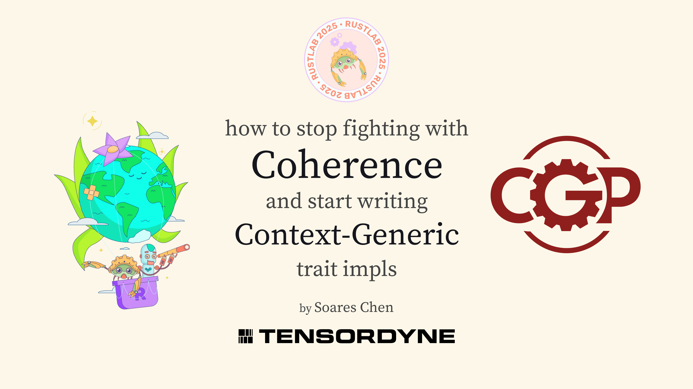

Hello, everyone, and thank you for coming to my talk. My name is Soares, and today, I'm going to show you how we can work around some common limitations of Rust's trait system, particularly the coherence rules, and start writing context-generic trait implementations.

## 1

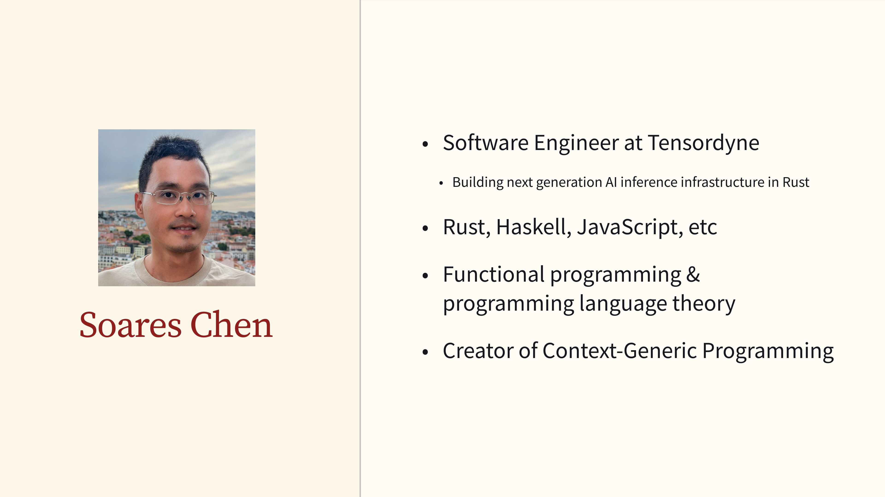

Before we dive in, let me tell you a little about myself. I have been programming for over 20 years, and right now I am working as a software engineer at Tensordyne to build the next generation AI inference infrastructure in Rust. Aside from Rust, I have also done a lot of functional programming in languages including Haskell and JavaScript. I am interested in both the theoretical and practical aspects of programming languages, and I am the creator of Context-Generic Programming, which is a modular programming paradigm for Rust that I will talk about today.

## 2

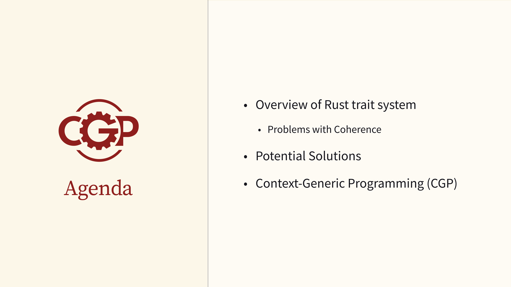

My talk is going to be divided into three parts. First, we will start with a quick overview of the Rust trait system and the challenges we face with its coherence rules. Next, we will explore some existing approaches to solving this problem. Finally, I will show you how my project, Context-Generic Programming makes it possible to write context-generic trait implementations without these coherence restrictions.

## 3

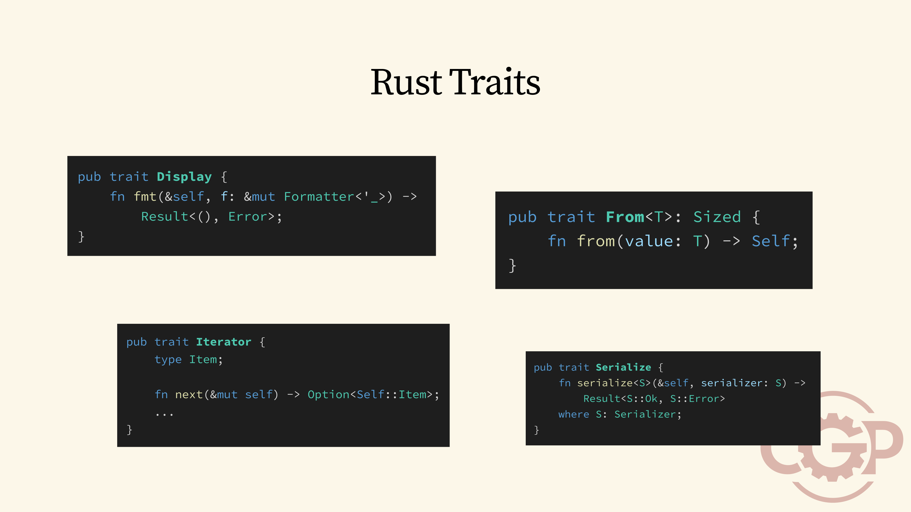

If you have been using Rust for a while, you know that one feature that stands out is the trait system. But have you ever wondered how traits really work, and what are their strengths and limitations?

## 4

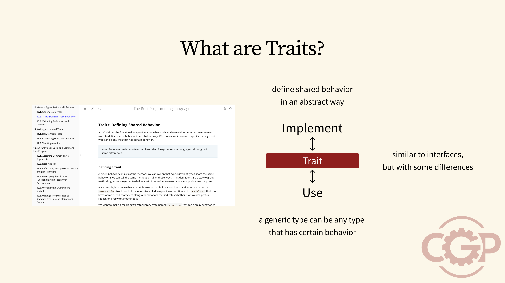

The Rust book gives us a great high-level description of traits, focusing on the idea of shared behavior. On one hand, traits allow us to implement these behaviors in an abstract way. On the other, we can use trait bounds and generics to work with any type that provides a specific behavior. This essentially gives us an interface to decouple the code that uses a behavior from the code that implements it. But, as the book also points out, the way traits work is quite different from the concept of interfaces in languages like Java or Go.

## 5

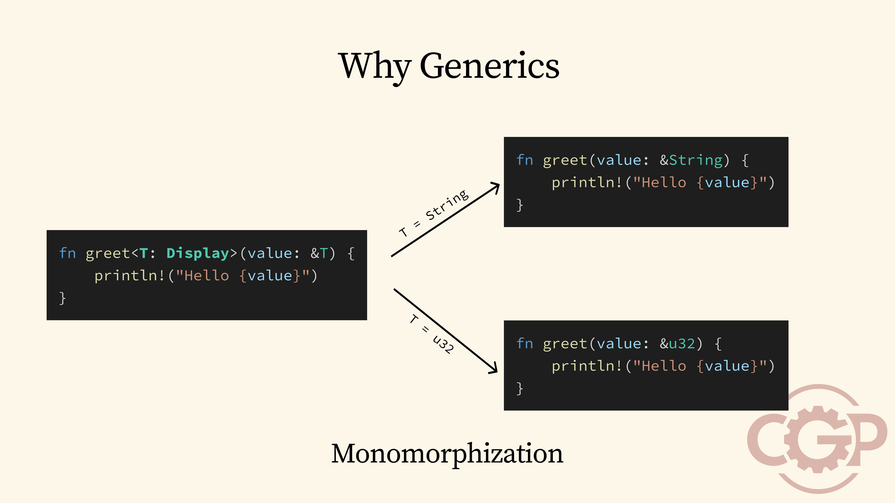

At a high level, traits are most often used with generics as a powerful way to write reusable code, such as the generic greet function shown here. When you call this function with a concrete type, the Rust compiler effectively generates a copy of the function that works specifically with that type. This process is also called monomorphization.

## 6

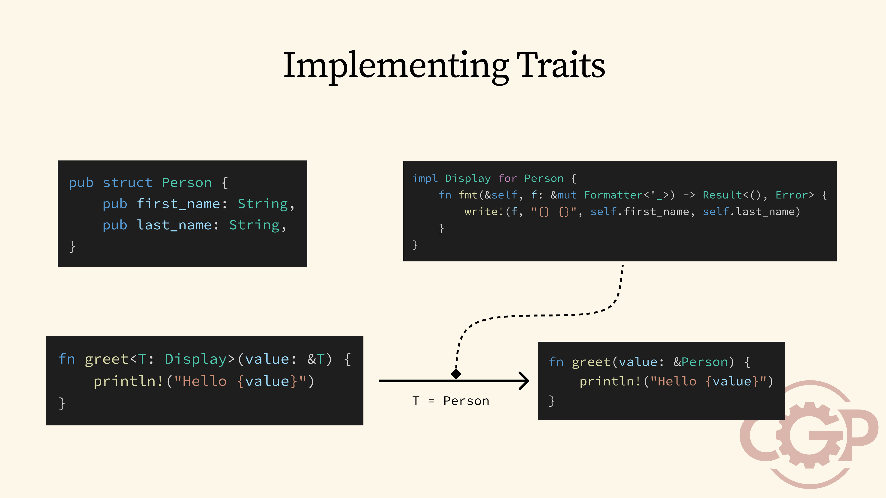

With generics, we can reuse the greet function with any type that implements `Display`, like the person type shown here. What happens behind the scenes is that Rust's trait system would perform a global lookup to search for an implementation of `Display` for `Person`, and use it to instantiate the greet function.

## 7

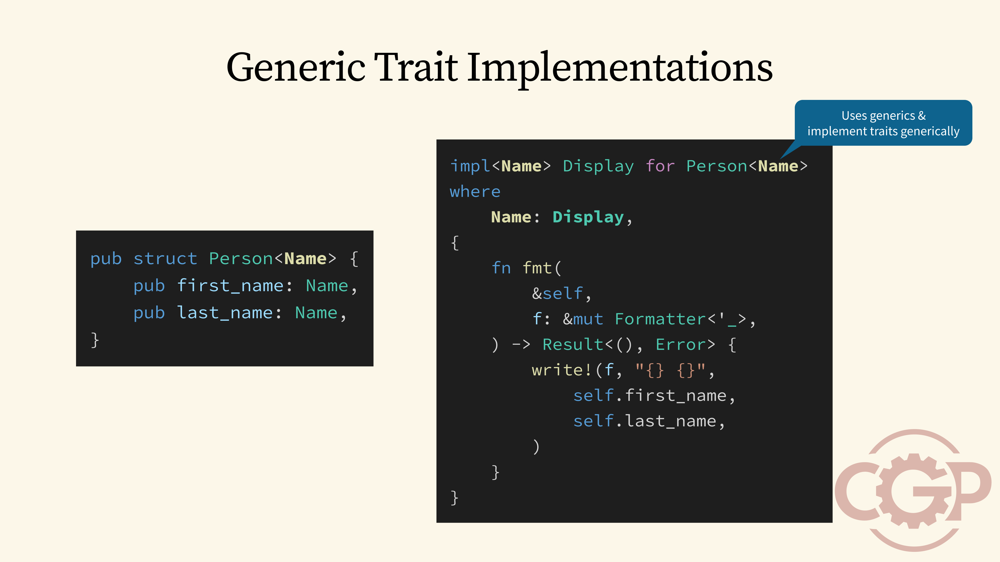

Now, a key strength of Rust traits is that we can implement them in a generic way. For example, imagine we want our `Person` struct to work with multiple Name types. Instead of writing a separate implementation for each Name type, we can write a single, generic implementation of the `Display` trait for `Person` that works for any Name type, as long as Name itself also implements `Display`.

## 8

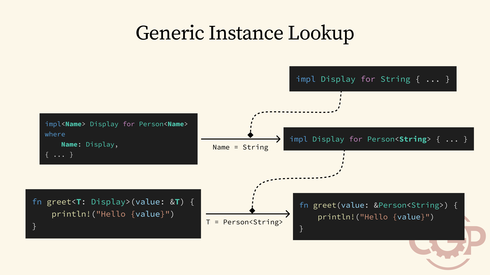

So, what happens behind the scenes when we instantiate our `Person` with `String`? When we try to use `Person<String>` with a function like greet, the trait system first looks for an implementation of Display specifically for `Person<String>`. What it instead finds is a generic implementation of `Display` for `Person<Name>`. To make that work, the trait system instantiates the generic `Name` type as a `String` and then goes further down to look for an implementation of `Display` for `String`.

## 9

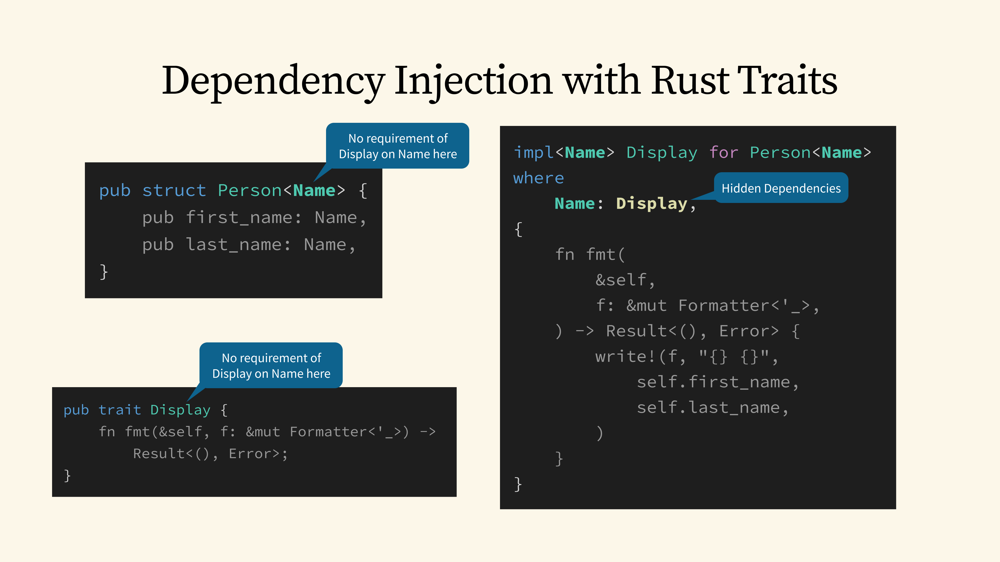

While this instance lookup might seem trivial and obvious, it highlights a hidden superpower of the trait system, which is that it gives us dependency injection for free. * Our Display implementation for Person is able to require an implementation of Display for Name inside the where clause, without explicitly declaring that dependency anywhere else. This means that when we define the Person struct, we don't have to declare up front that Name needs to implement Display. And similarly, the Display trait doesn't need to worry about how Person gets a Display instance for Name.

## 10

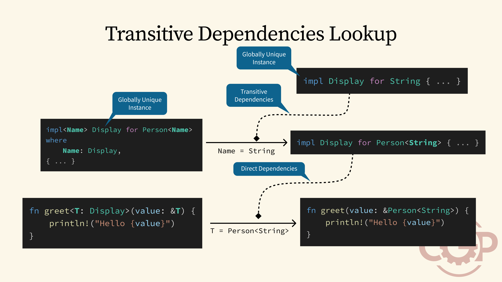

This form of dependency injection is what makes Rust traits so much more powerful than interfaces in other languages, because the trait system is not only able to look up for direct dependencies, but also perform lookup for any transitive dependencies and automatically instantiate generic trait implementations, no matter how deep the dependency graph goes. However, for the trait system to be able to support this kind of transitive dependencies, it has to impose a strict requirement that the lookup for all trait implementations must result in globally unique instances, no matter when and where the lookup is performed.

## 11

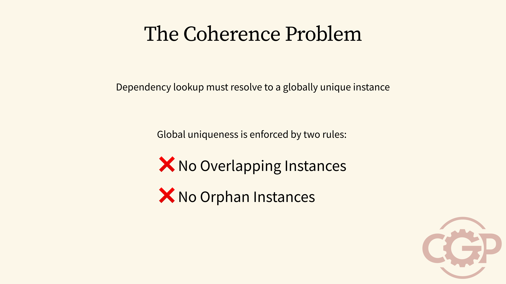

This brings us to one of the most contentious limitations when we use Rust traits today, which is known as the coherence problem. To ensure that trait lookups always resolve to a single, unique instance, Rust enforces two key rules on how traits can or cannot be implemented. The first rule states that there cannot be two trait implementations that overlap when instantiated with some concrete type. The second rule states that a trait implementation can only be defined in a crate that owns either the type or the trait. In other words, no orphan instance is allowed.

## 12

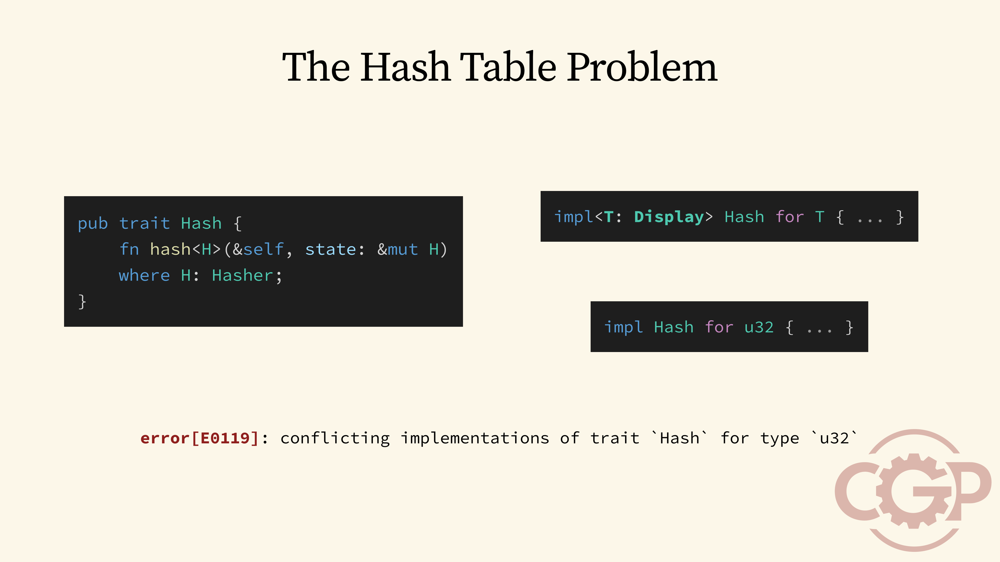

To understand why these rules are so important, we will walk through a concrete example known as the hash table problem. Let's say we want to make it super easy for any type to implement the Hash trait. * A naive way would be to create a blanket implementation for Hash for any type that implements Display. This way, we could just format the value into a string using Display, and then compute the hash based on that string. * But what happens if we then try to implement Hash for a type like u32 that already implements Display? * We would get a compiler error that rejects these conflicting implementations.

## 13

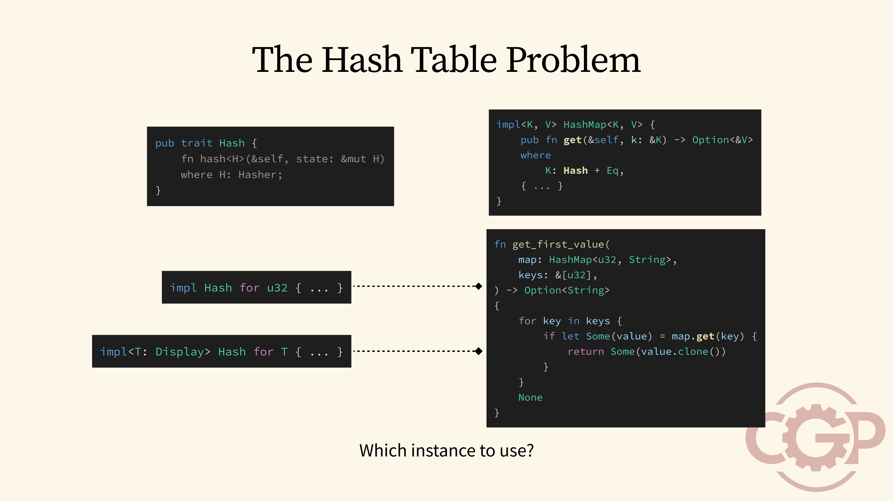

To see why this overlapping implementation is so problematic, let's look at how the Hash trait is used inside a HashMap. The HashMap's methods, like get, use the Hash trait to compute a hash value for the key, which determines the bucket where the value is stored. For the algorithm to work correctly, the exact same hash function must be used every single time. Now, what happens if we have a situation where both our blanket implementation and a specialized implementation for a type like u32 are available? We might be tempted to say we will always choose the more specialized implementation, but that approach doesn't always work.

## 14

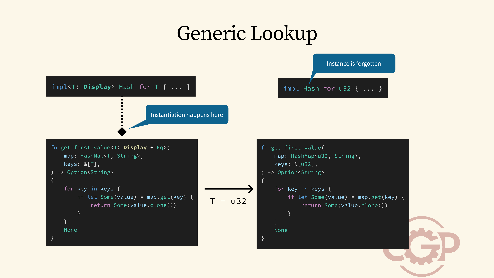

This is because Rust allows blanket implementations to be used inside generic code without them appearing in the trait bound. For example, the get_first_value function can be rewritten to work with any key type T that implements Display and Eq. * When this generic code is compiled, Rust would find that there is a blanket implementation of Hash for any type T that implements Display, and use that to compile our generic code. * If we later on instantiate the generic type to be u32, the specialized instance would have been forgotten, since it does not appear in the original trait bound.

## 15

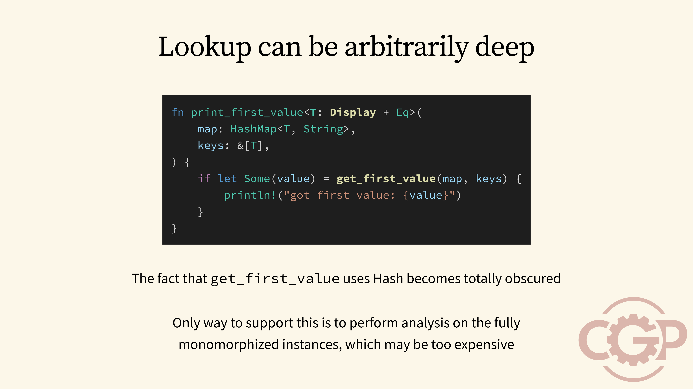

There are good reasons why Rust cannot feasibly detect and replace all blanket implementations with specialized implementations during instantiation. This is because a function like get_first_value can be called by other generic functions, such as the print_first_value function that is defined here. In this case, the fact that get_first_value uses Hash becomes totally obscured, and it would not be obvious that print_first_value indirectly uses it by just looking at the generic trait bound.

## 16

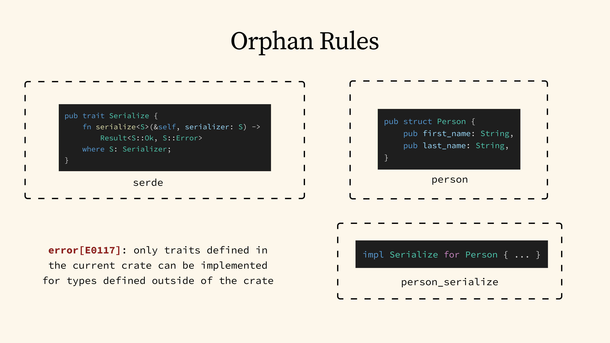

Now that we've seen the problems with overlapping instances, let's look at the second coherence rule, which forbids orphan implementations. This restriction is most well-known for the following use case. On one hand, we have the serde crate, which defines the Serialize trait that is used pretty much everywhere. * And then we have a library crate that defines a data type, say, a Person struct. Suppose the person crate doesn't implement Serialize for Person, but we still want to serialize Person into formats like JSON. * A naive attempt would be to implement it in a third-party crate. * But if we try that, the compiler will give us an error. It will tell us that this implementation can only be defined in a crate that owns either the Serialize trait or the Person type.

## 17

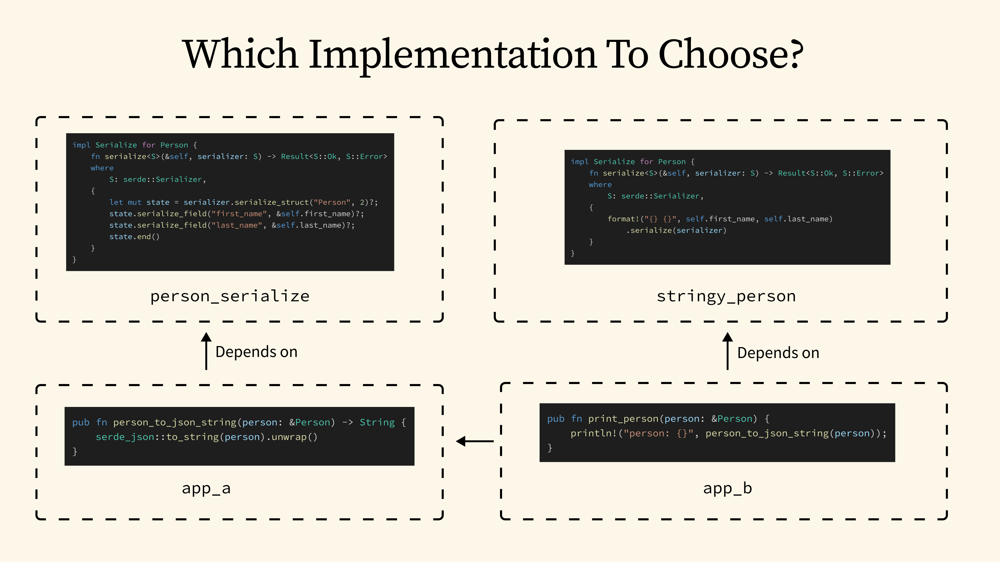

So, why are these orphan instances disallowed? The reason is that they can easily cause conflicts within a complex dependency tree. * Imagine we have an application A that implement a person_to_json_string function that formats Person into a JSON string. * Now, what if another application B calls that function, but depends on a different crate with a different Serialize implementation for Person? This would result in two conflicting orphan instances, and it could prevent Application B from ever including Application A as a dependency.

## 18

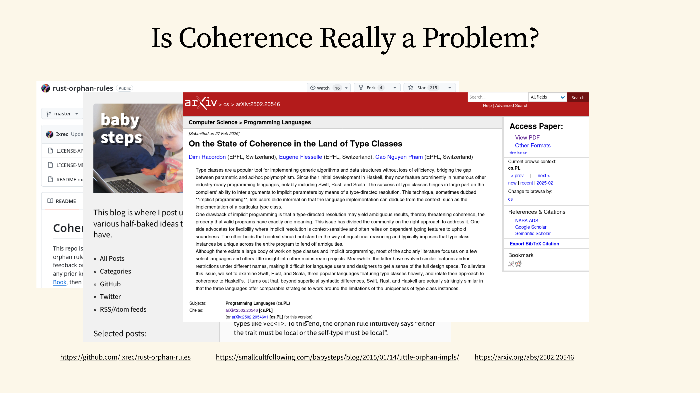

I hope my quick overview has convinced you that coherence is a problem worth solving! If you want to dive deeper, there are tons of great resources online that go into much more detail. I would recommend the rust-orphan-rules repository, which collects all the real-world use cases blocked by the coherence rules. * You should also check out Niko Matsakis's blog posts, which cover the many challenges the Rust compiler team has faced trying to relax some of these restrictions. * And it is worth noting that the coherence problem is not unique to Rust; it is a well-studied topic in other functional languages like Haskell and Scala as well.

## 19

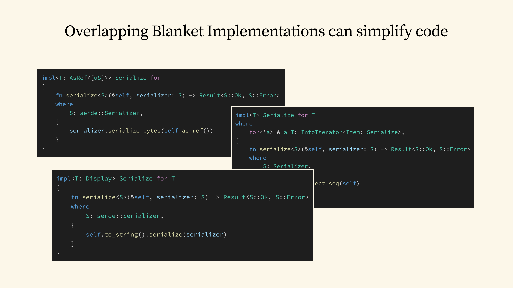

But what if we could have overlapping implementations? It would simplify the trait implementation for a lot of types. For example, we might want to automatically implement Serialize for any type that contains a byte slice, * or for any type that implements IntoIterator, * or even for any type that implements Display. The real challenge isn't in how we implement them, but rather in how we choose from these multiple, generic implementations.

## 20

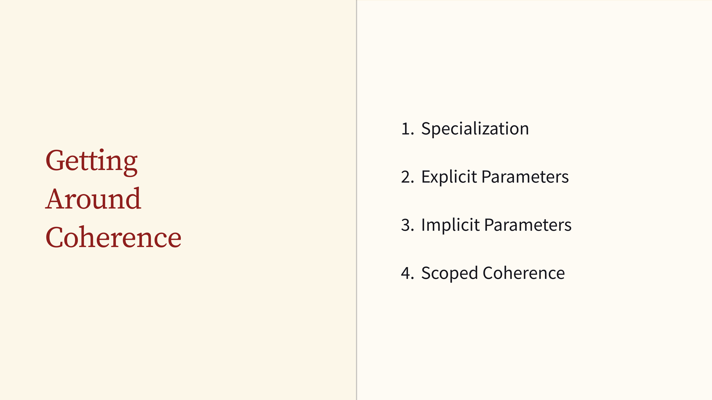

Since the early days of Rust, the community has seen many attempts to work around these coherence restrictions. Let's walk through some of the most common approaches and see how they have tried to solve this.

## 21

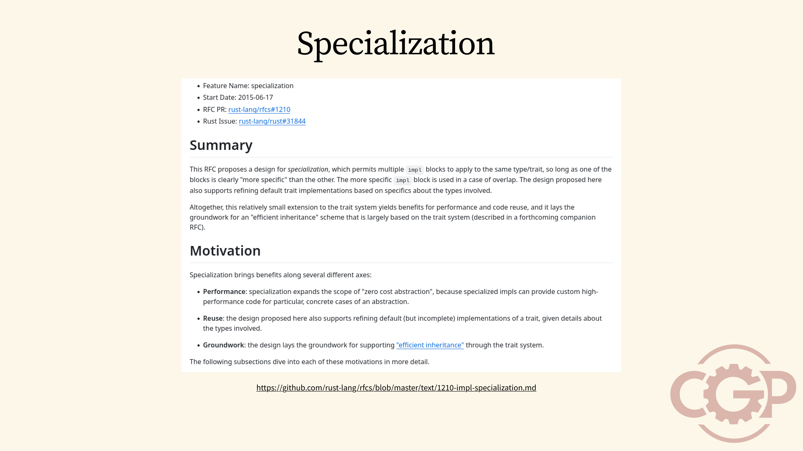

One of the most anticipated features in Rust is called **specialization**, which specifically aims to relax the coherence restrictions and allow some form of overlapping implementations in Rust.

## 22

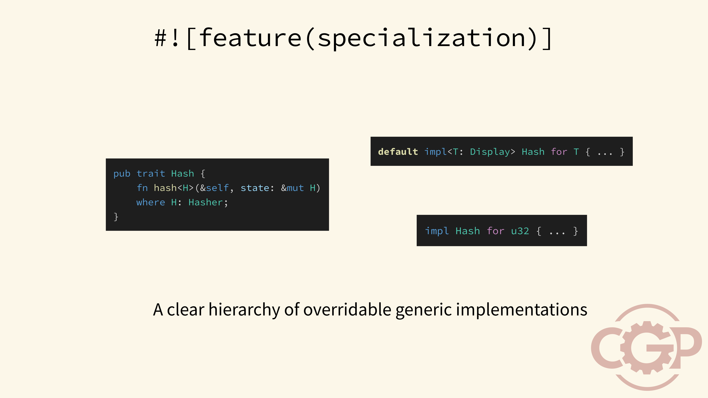

The way specialization works is as follows. By enabling the specialization feature in nightly, we can annotate a generic trait implementation to be specializable using the default keyword. This allows us to have a default implementation that can be overridden by more specific implementations.

## 23

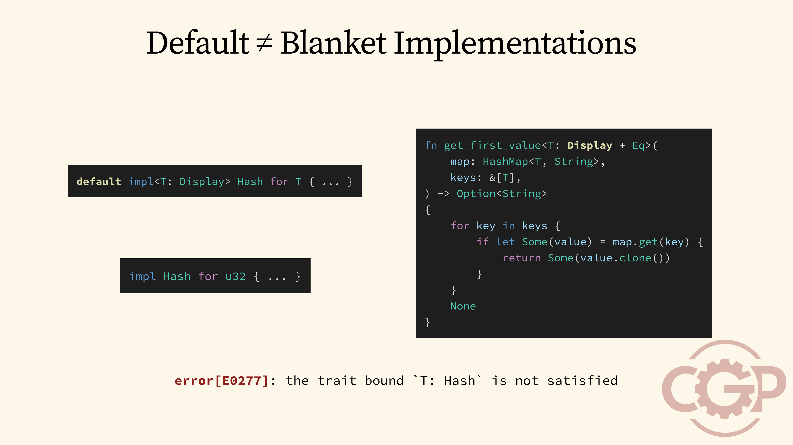

It is worth noting that this new form of default implementation is different from the blanket implementation that we are used to. In particular, if we go back to our previous example, * we would find that we can no longer use the default implementation of T implementing Display to use the Hash trait inside our generic function. This makes sense, because the correct Hash implementation can now only be chosen when the concrete type is known.

## 24

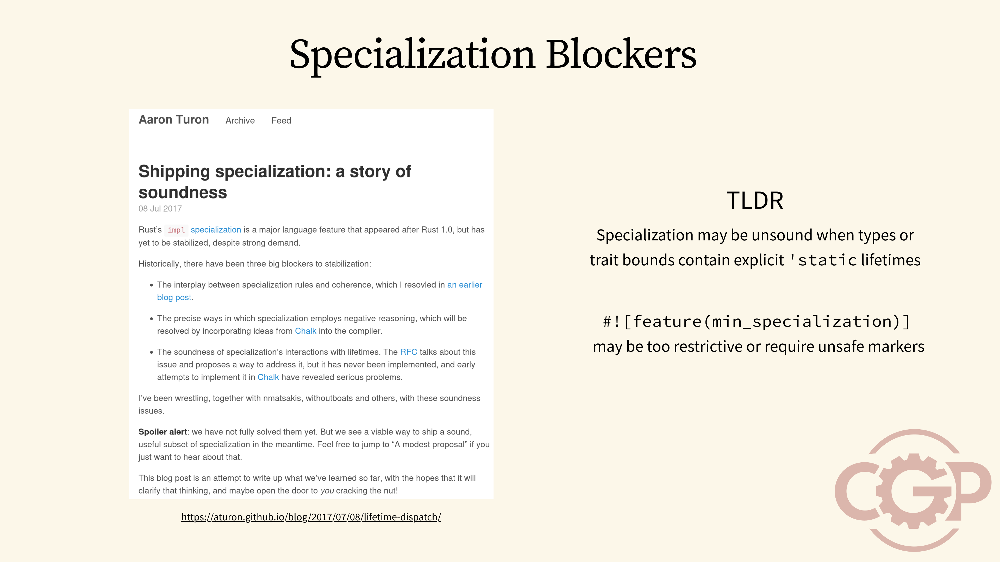

While the specialization feature is promising, it has unfortunately remained in nightly due to some challenges in the soundness of the implementation.

## 25

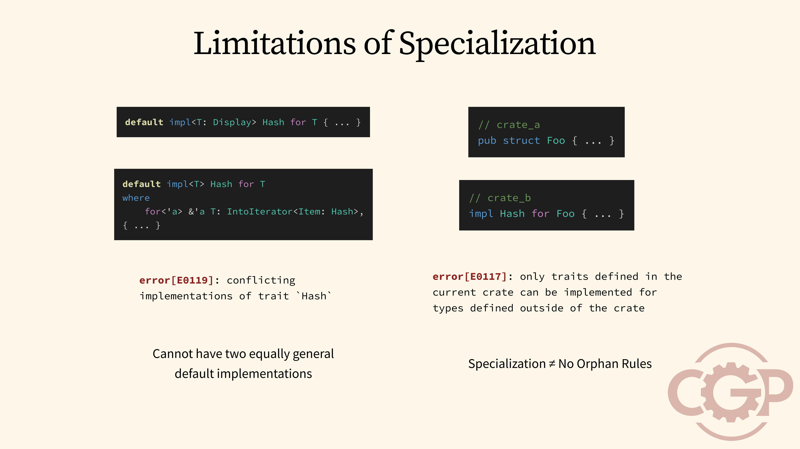

Furthermore, specialization only relaxes but not completely removes the rules for overlapping implementations. For instance, it is still not possible to define multiple overlapping implementations that are equally general, even with the use of specialization. Specialization also doesn't address the orphan rules. So we still cannot define orphan implementations outside of crates that own either the trait or the type.

## 26

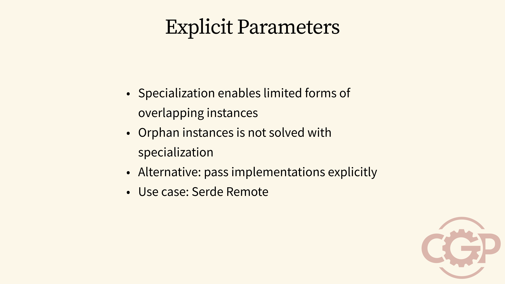

Given that specialization is still unstable and doesn't fully solve the coherence problem, we are going to explore other ways to handle it. A well-established approach is to define our implementations as regular functions instead of trait implementations. We can then explicitly pass these functions to other constructs that need them. This might sound a little complex, but the 'remote' feature of Serde helps to streamline this entire process, as we're about to see.

## 27

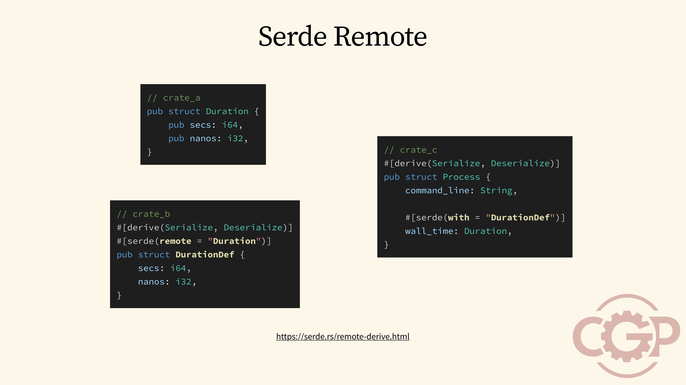

From the Serde documentation, we have a great example using a Duration type. Let's say the original crate that defines this Duration type doesn't implement Serialize. * We can define an external implementation of Serialize for Duration in a separate crate by using the Serde's remote attribute. To do this, we will need to create a proxy struct, let's call it DurationDef, which contains the exact same fields as the original Duration. * Once that is in place, we can use Serde's with attribute in other parts of our code to serialize the original Duration type, using the custom DurationDef serializer that we have just defined.

## 28

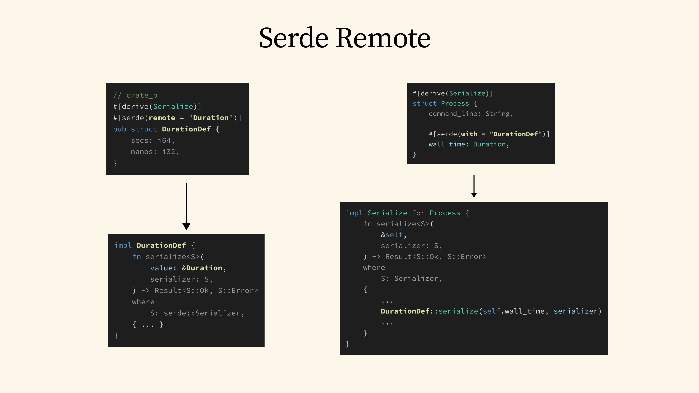

Behind the scenes, Serde doesn't actually generate a Serialize trait implementation for DurationDef or Duration. * Instead, it generates a serialize method for DurationDef that has a similar signature as the Serialize trait's method. However, the method is designed to accept the remote Duration type as the value to be serialized. * When we then use Serde's with attribute, the generated code simply calls DurationDef::serialize.

## 29

The Serde remote pattern works well to support explicit implementations when the coherence rules prevent the implementation of the Serialize or Deserialize trait. However, it is not without its drawbacks. If other crates wanted to adopt a similar pattern, they would need to implement their own complex proc macros just for their specific traits. So, with these limitations in mind, let's think about how we can generalize this pattern and make it much easier to support explicit implementations across the board.

## 30

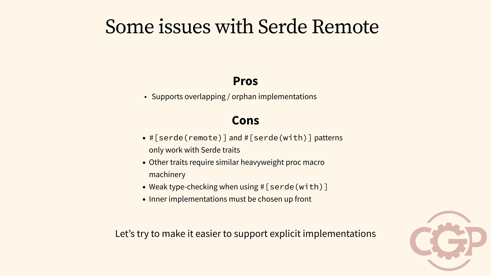

When we look at how Serde is used in the wild, we would see a lot of ad-hoc serialization functions. But since we expect them to all have the same signature, why not define a proper trait to classify them? * We can define what we will call a provider trait, which is named SerializeImpl, that mirrors the structure of the original Serialize trait, which we will now call a consumer trait. Unlike consumer traits, provider traits are specifically designed to bypass the coherence restrictions and allow multiple, overlapping implementations. * We do this by moving the Self type to an explicit generic parameter, which you can see here as T.

## 31

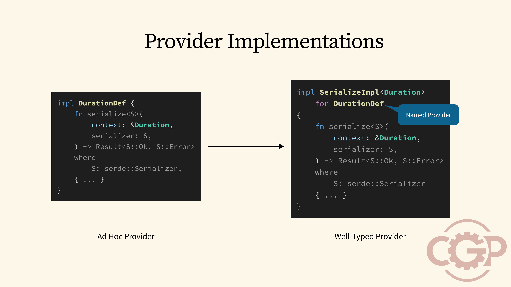

With provider traits, we can now rewrite our ad-hoc serialize functions to implement the SerializeImpl provider trait. * For the case of DurationDef, we would implement the trait with Duration specified as the value type in the generic parameter, whereas after the for keyword, we use DurationDef as the Self type to implement SerializeImpl. * With this, the Self type effectively becomes an identifier to name a specific implementation of a provider trait.

## 32

The use of the provider trait pattern opens up new possibilities for how we can define overlapping and orphan implementations. For example, * instead of writing an overlapping blanket implementation of Serialize for any type that implements `AsRef<[u8]>`, we can now write that as a generic implementation on the SerializeImpl provider trait. * The key to this trick is that Rust's coherence rules only apply to the Self type of a trait implementation. But if we always define a unique dummy struct and use that as the Self type, then Rust would happily accept our generic implementation as non-overlapping and non-orphan.

## 33

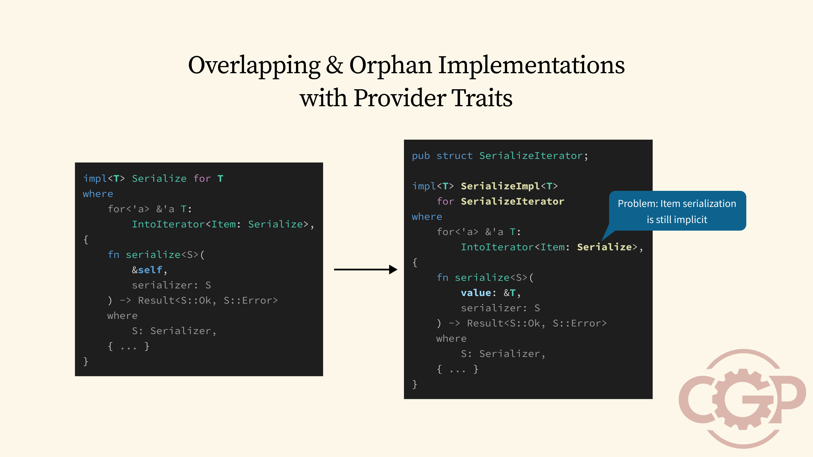

This approach lets us rewrite any number of overlapping implementations and turn them into named, specific implementations. For example, * here is a generic implementation called SerializeIterator. It is designed to implement SerializeImpl for any value type T that implements IntoIterator. However, * in order to serialize the items, SerializeIterator still depends on the inner item's type to implement Serialize. This prevents us from easily customizing how the inner item is serialized, for example, by using the SerializeBytes provider that we have created previously.

## 34

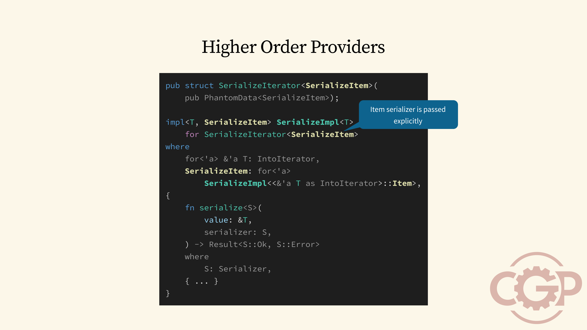

So, how can we solve this? One way is to explicitly pass the inner serializer provider as a type parameter directly to SerializeIterator. We will call this pattern higher-order providers, * because SerializeIterator now has a generic parameter specifically for the item serializer. With this in place, our SerializeIterator implementation can now require that SerializeItem also implements SerializeImpl, using the iterator's item as the value type.

## 35

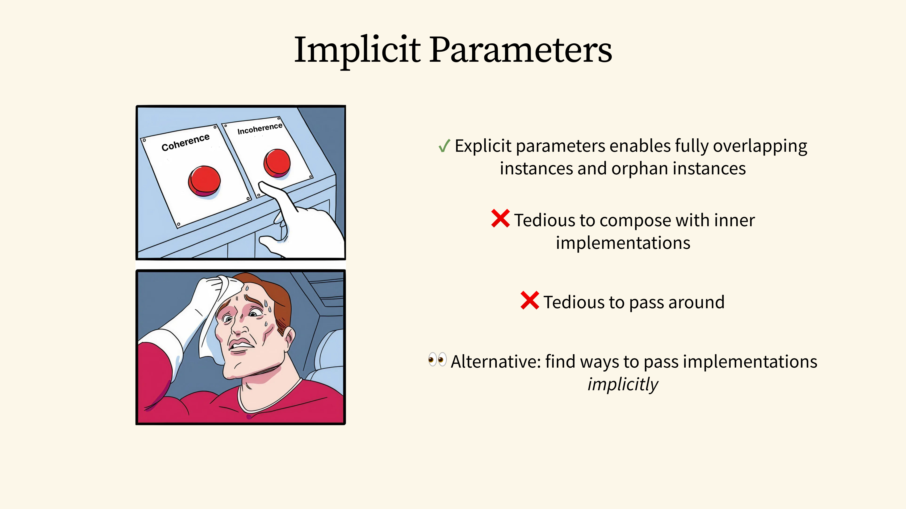

As we can see, the use of provider traits allows us to fully bypass the coherence restrictions and define multiple fully overlapping and orphan instances. However, with coherence being no longer available, these implementations must now be passed around explicitly. This includes the use of higher-order providers to compose the inner implementations, and this can quickly become tedious as the application grows. This is often the reason why we don't see explicit implementations used that often. However, one way we can get around this is to find ways to pass around these provider implementations implicitly.

## 36

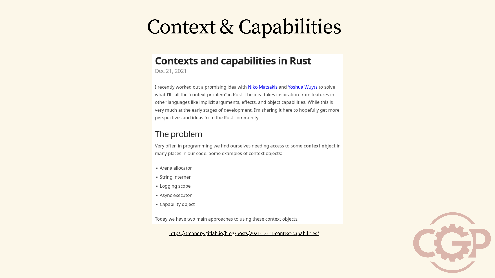

The idea of passing implementations automatically is also known as implicit parameters in other languages, such as Scala and Haskell. In Rust, however, a similar concept is being proposed, known as context and capabilities, which is what we will explore next.

## 37

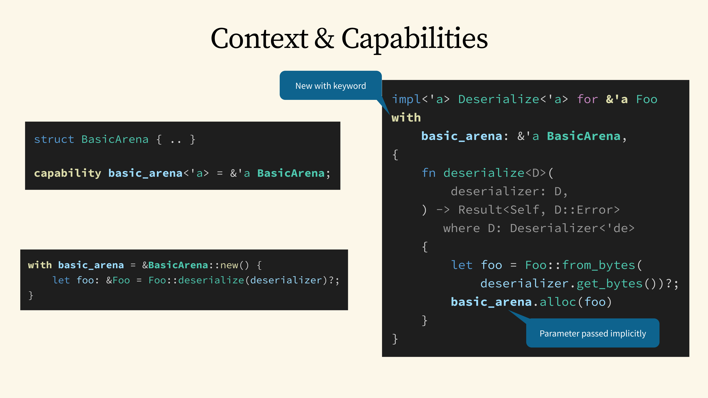

The main idea behind context and capabilities is that we can write trait implementations that depend on a specific value or type called a capability. This capability is provided by the code that uses the trait. For the use case presented in the proposal, this means we can retrieve an arena allocator from the surrounding context and use it to allocate memory for a deserialized value. * The proposal introduces a new with keyword, which can be used to retrieve any value from the environment, such as a basic_arena.

## 38

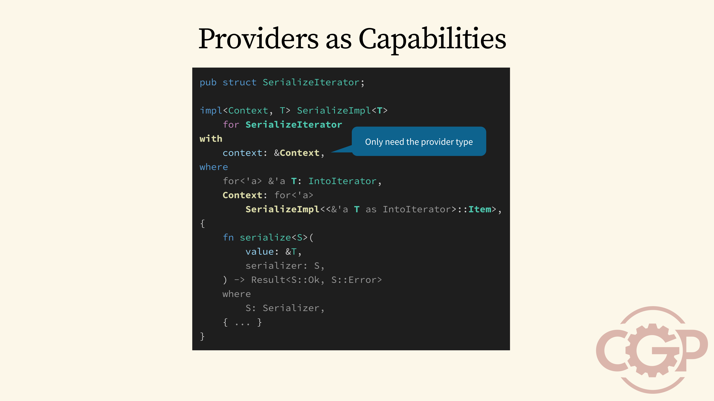

Using context and capabilities, we can implicitly pass our provider implementations through an implicit context. For our SerializeIterator example, we can use the with keyword to get a context value that has a generic Context type. But, * for this specific use case, we only need the context type to implement the provider trait we are interested in, which is the SerializeImpl trait for our iterator's items.

## 39

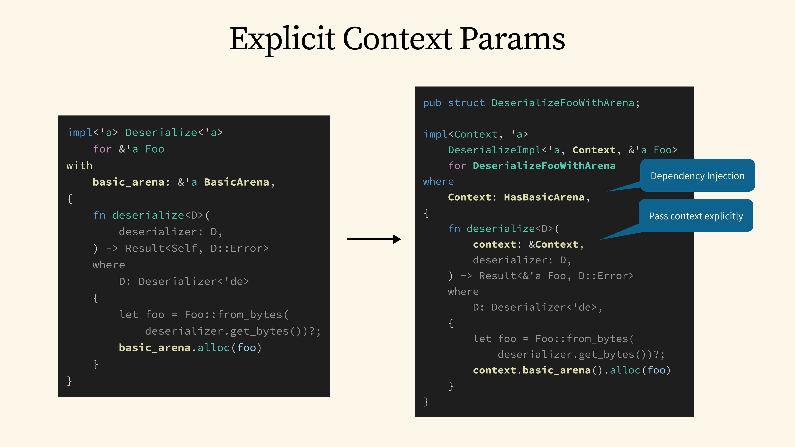

Since the context and capabilities feature is currently just a proposal, we cannot use it directly in Rust yet. * But we can emulate this pattern by explicitly passing a Context parameter through our traits. For deserialization, this means we would define a provider trait called DeserializeImpl, which now takes a Context parameter in addition to the value. From there, * we can use dependency injection to get an accessor trait, like HasBasicArena, which lets us pull the arena value directly from our Context. As a result, our deserialize method now accepts this extra context parameter, allowing any dependencies, like basic arena, to be retrieved from that value.

## 40

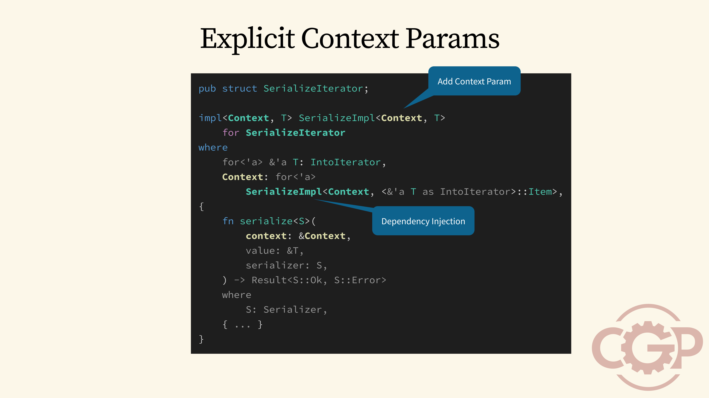

We can apply this same pattern to the SerializeImpl provider trait, * by adding an extra Context parameter there as well. With that, we can, for example, retrieve the implementation of SerializeImpl for an iterator's item directly from the Context type using dependency injection.

## 41

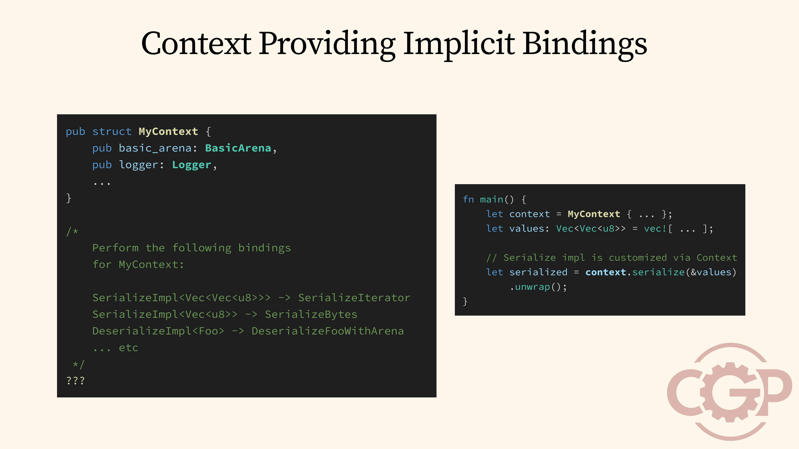

With the introduction of an explicit Context type, we can now define a type like MyContext shown here, which carries all the values that our provider implementations might need. Additionally, there is still a missing step, which is how we can pass our provider implementations through the context. Ideally, after MyContext is defined, we would be able to build a context value, call serialize on it, and have all the necessary dependencies passed implicitly to implement the final serialize method.

## 42

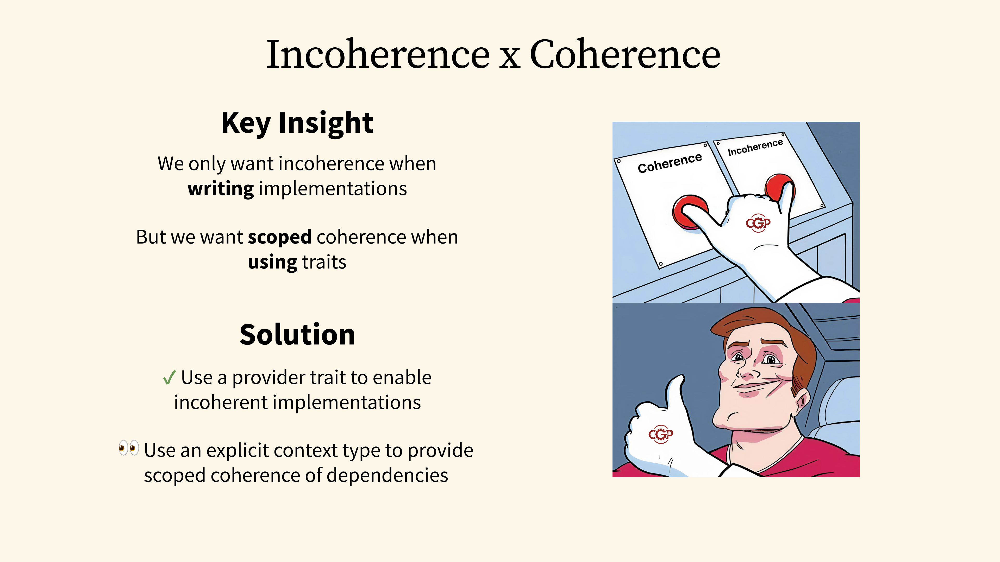

If we revisit our attempts and think about what we really want to achieve, we would arrive at the following key insight. When it comes to implementations, we don't want coherence to get in our way, so we can always write the most general implementations possible. But when it comes to using these implementations, we want a way to create many local scopes, with each providing its own implementations that are coherent within that specific scope. * We have already explored the first part of the solution, which is to introduce provider traits to enable incoherent implementations. The next step is to figure out how to define explicit context types that bring back coherence at the local level.

## 43

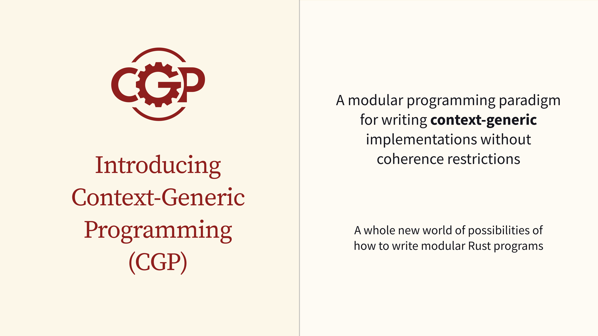

The full solution that I will present here is called context-generic programming, or CGP in short. As its name implied, CGP is a modular programming paradigm that allows us to write implementations that are generic over a context type without the coherence restrictions.

## 44

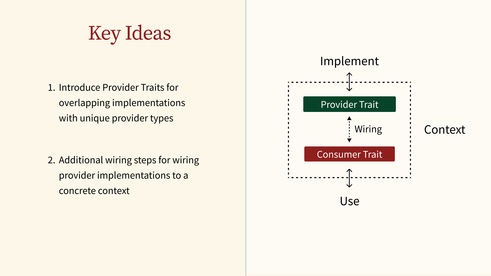

There are two key ideas behind CGP. First, we introduce the concept of provider traits to enable overlapping implementations that are identified by unique provider types. Secondly, we add an extra wiring step to connect those provider implementations to a specific context. What we effectively achieve is that we create two separate interfaces to further decouple the code that implements a behavior from the code that uses a behavior.

## 45

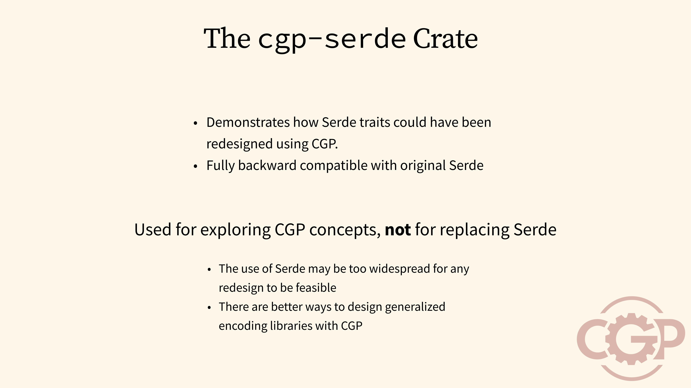

To demonstrate how this works, we will introduce the cgp-serde crate to demonstrate how the Serialize trait could be redesigned with CGP. The crate is fully backward-compatible with the original Serde crate, but its main purpose is to help us explore CGP using familiar concepts. Just to be clear, since Serde is so widely used, I'm not proposing that we should all abandon it and switch to cgp-serde.

## 46

The cgp-serde crate defines a context-generic version of the Serialize trait, called CanSerializeValue. Compared to the original, this trait has the target value type specified as a generic parameter, and the serialize method accepts an additional self reference as the surrounding context. This trait is defined as a consumer trait and is annotated with the cgp_component macro. * Behind the scenes, the macro generates a few additional constructs. The first is a dummy struct called ValueSerializerComponent, which serves as the component name. Secondly, it generates a provider trait called ValueSerializer, with the self type now becoming an explicit context type in the generic parameter.

## 47

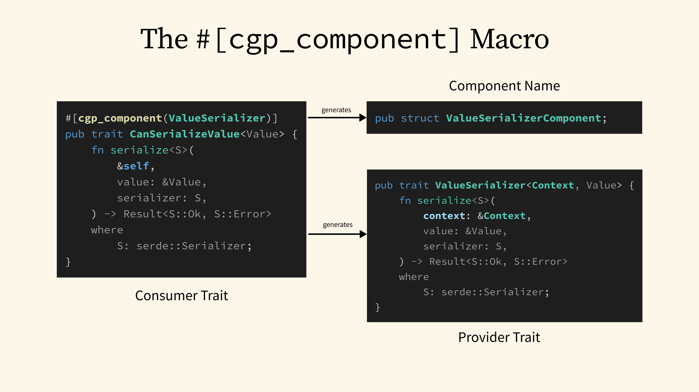

CGP also provides the cgp_impl macro to help us implement a provider trait easily as if we are writing blanket implementations. * Compared to before, the example SerializeIterator provider shown here can use dependency injection through the generic context, and it can require the context to implement CanSerializeValue for the iterator's items.

## 48

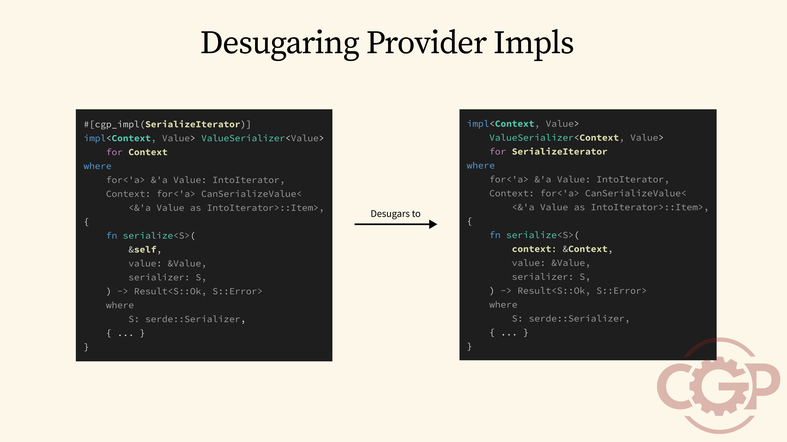

Behind the scene, the cgp_impl macro desugars our provider trait implementation to move the generic context parameter to the first position of ValueSerializer's trait parameters, and use the name SerializeIterator as the self type. It also replaces all references to self to refer to the context type explicitly.

## 49

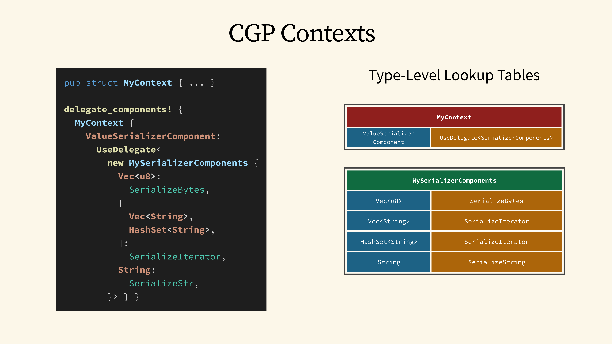

Once we have defined our context-generic providers, we can now define new context types and set up the wiring of value serializer providers for that context. In this example, we define a new MyContext struct, and then we use the delegate_components macro to wire up the components for MyContext. * Behind the scenes, what this code effectively does is that it generates multiple type-level lookup tables for MyContext to lookup the implementations for a given CGP trait.

## 50

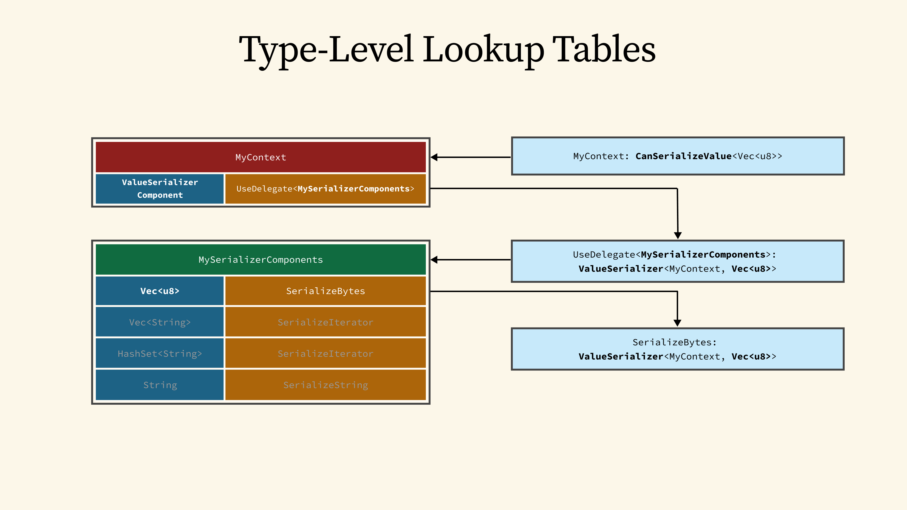

Here is a high-level overview of how these type-level lookup tables work. Suppose that we want to use CanSerializeValue on MyContext to serialize `Vec<u8>`. * The system first checks its corresponding table, and uses the component name, ValueSerializerComponent, as the key to find the corresponding provider. * This leads us to the UseDelegate provider, which makes use of yet another table, called MySerializerComponents, to perform one more lookup. This time, the key is based on our value type, `Vec<u8>`, and that leads us finally to the SerializeBytes provider.

## 51

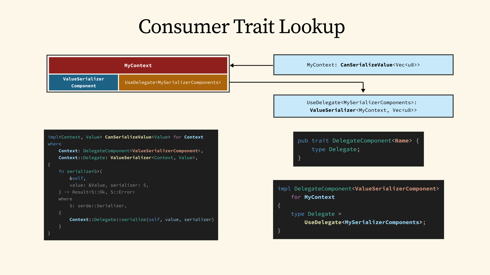

To understand how this works behind the scenes, *the type-level lookup is actually performed by the trait system using blanket implementations that are generated by the cgp_component macro. For the first level lookup, the blanket implementation for CanSerializeValue automatically implements the trait for MyContext by performing a lookup through the `ValueSerializerComponent` key. This key-value lookup is implemented through the DelegateComponent trait, which takes the key as a generic parameter and maps it to the associated Delegate type.

## 52

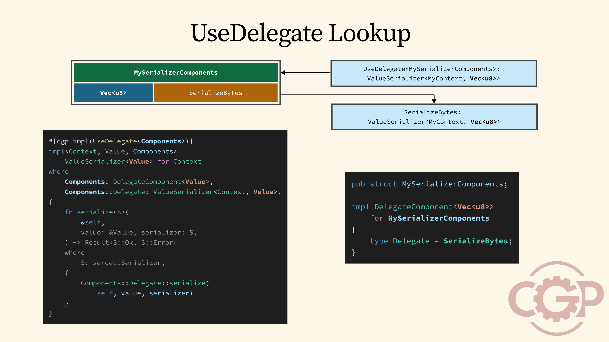

Next, * the macro also generates a special UseDelegate provider, which implements the ValueSerializer provider trait by performing another type-level lookup through the MySerializerComponents table, but this time we use the value type `Vec<u8>` as the lookup key.

## 53

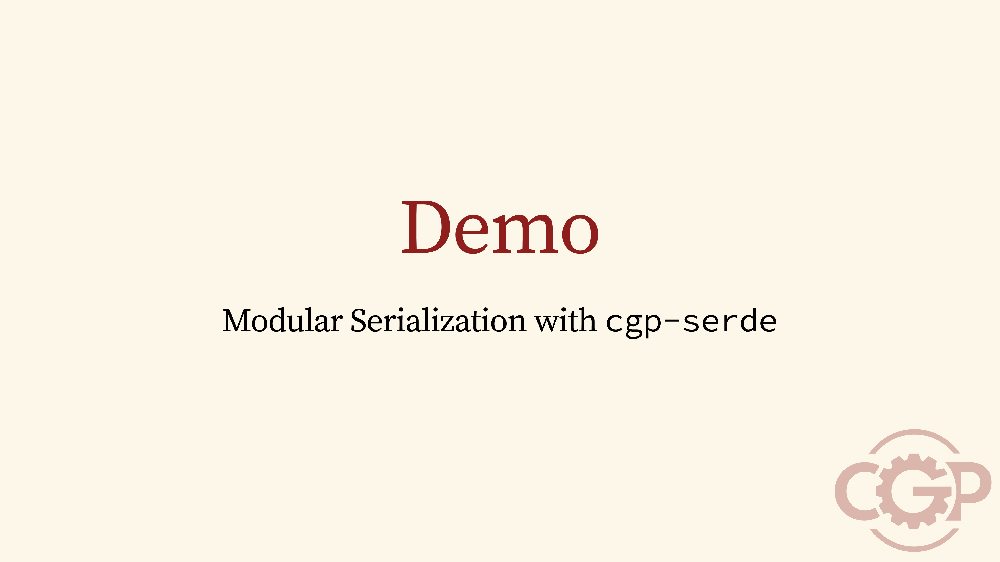

Now with the high-level concepts introduced, let's look at a practical demonstration of the modular serialization capabilities that are enabled by cgp-serde.

## 54

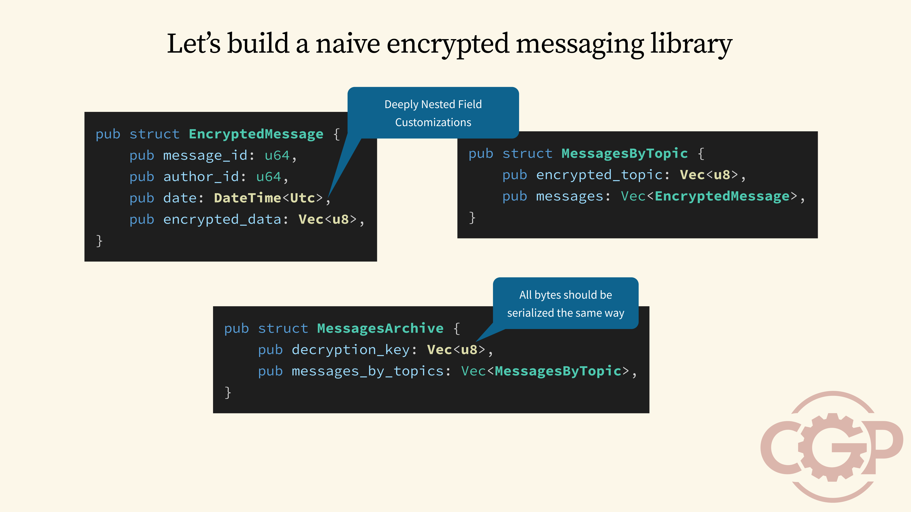

Let's imagine we are building a simple encrypted messaging library. A good way to start would be by defining our core data types, like the EncryptedMessage struct you see here. From there, * our library would need to handle tasks like retrieving all messages grouped by an encrypted topic, or exporting all messages along with a decryption key that is protected by a password. Once we have built the library, though, we might encounter a challenge, * which is how do we handle serialization for these complex data types? The core problem is that we may need to customize how we serialize deeply nested fields, like DateTime or `Vec<u8>`. And beyond that, we will likely want to ensure that our serialization scheme is consistent across the entire application.

## 55

Now, let's imagine our library is adopted by larger applications with their own specific needs. On one hand, we have Application A, which requires our bytes to be serialized as hexadecimal strings and DateTime values to be in the RFC3339 format. Then, along comes Application B, which needs base64 for the bytes and Unix timestamps for DateTime. Both of these applications may have valid reasons for their choices, perhaps for compatibility with other APIs they use. We could, of course, ask them to write their own custom serialization implementations using a tool like Serde remote. But if our library were to grow to include a dozen or more data types, that tedious work would quickly become unmanageable and forces a lot of extra effort onto our users.

## 56

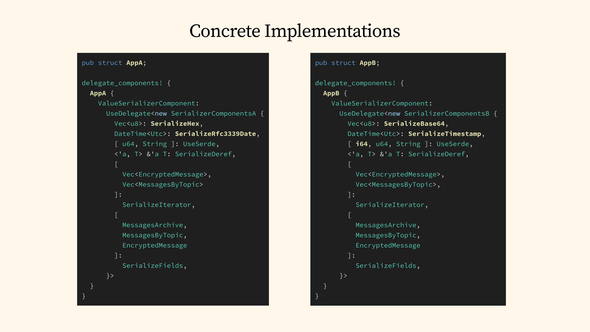

This is where a solution like cgp-serde comes in. With it, each application can now easily customize the serialization strategy for every single value type without us having to change any code in our core library. The code you see here demonstrates exactly how Application A explicitly wires up the provider implementation for all the value types it uses. * Now, let's switch over and look at Application B. The main differences are simply these three lines, where we have wired up the specific serialization for `Vec<u8>`, DateTime, and i64.

## 57

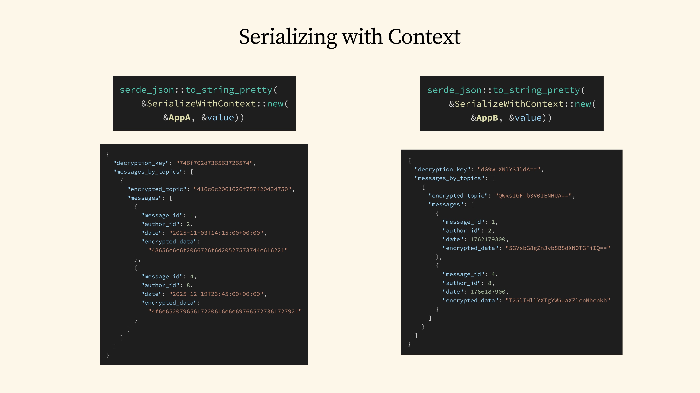

With both of our application contexts now defined, we can easily use existing libraries like serde_json to serialize our encrypted message archive into JSON. cgp-serde remains compatible with the existing serde ecosystem. It achieves this by providing a simple SerializeWithContext adapter, which is how it's able to pass the context along with the target value to be serialized. And now, * by simply switching the context type to Application B, we immediately get the different serialization output that we wanted.

## 58

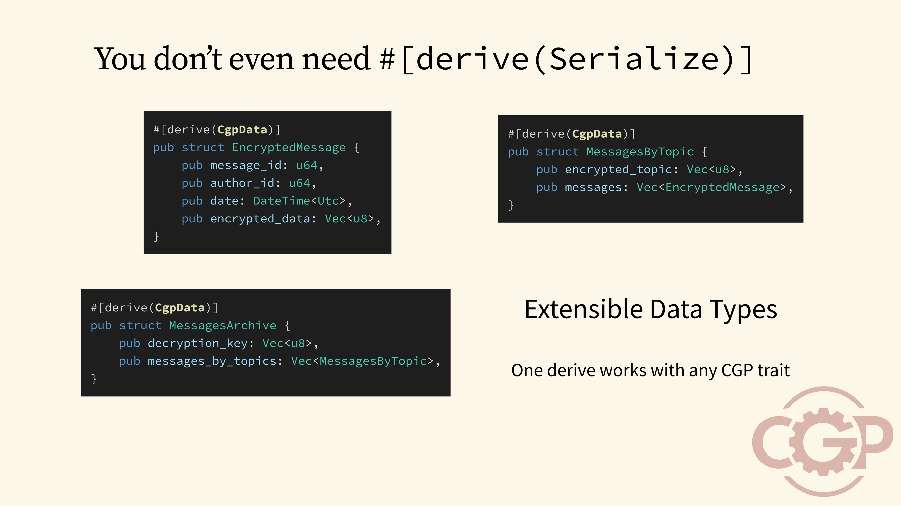

A key advantage of using cgp-serde is that our library doesn't even need to derive Serialize for its data types, or include serde as a dependency at all. Instead, all we have to do is to derive CgpData. * This automatically generates a variety of support traits for extensible data types, which makes it possible for our composite data types to work with a context-generic trait without needing further derivation.

## 59

Conclusion

## 60

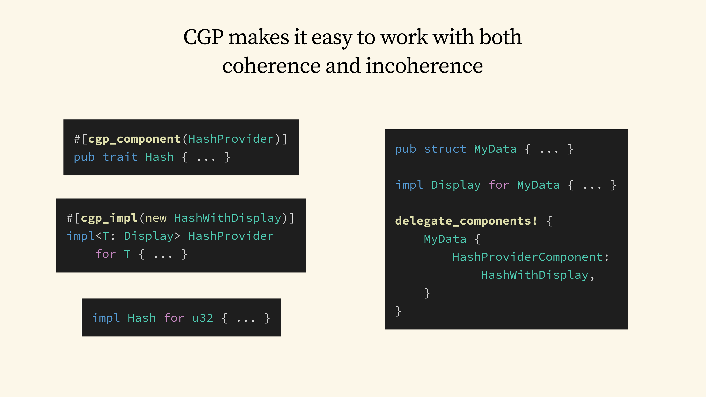

As we have seen earlier, by providing a way around the coherence restrictions, CGP unlocks powerful design patterns that would have been challenging to achieve in vanilla Rust today. The best part of all is that CGP enables all these without sacrificing any benefits provided by the existing trait system. If we now revisit the hash table problem, the solution provided by CGP is straightforward: we can first use the cgp_component macro to generate the provider trait and blanket implementations for the Hash trait. * We then use the cgp_impl macro to implement named providers that can overlap with no restriction. * On the other hand, any existing implementation of the hash trait would continue to work without any modification needed. * Finally, if we want to implement Hash for our own data types by reusing an existing named provider, we can easily do so using the delegate_components macro.

## 61

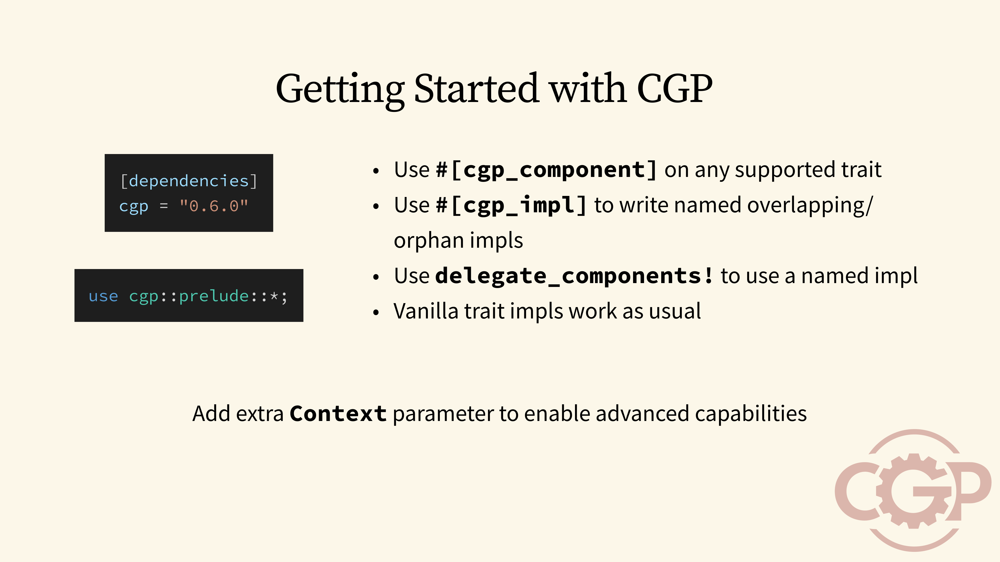

If you would like to get started with CGP today, the onboarding process is straightforward. You can include the latest version of the cgp crate as your dependency, and import the prelude in your code. In many cases, you can simply add the cgp_component macro to a trait in your code base, and existing code will continue to work. Then you can start writing context-generic implementations using the cgp_impl macro, and reuse them on a context through the delegate_components macro. Once you get comfortable and want to unlock more advanced capabilities, such as the ones used in cgp-serde, you can do so by adding an additional context parameter to your traits.

## 62

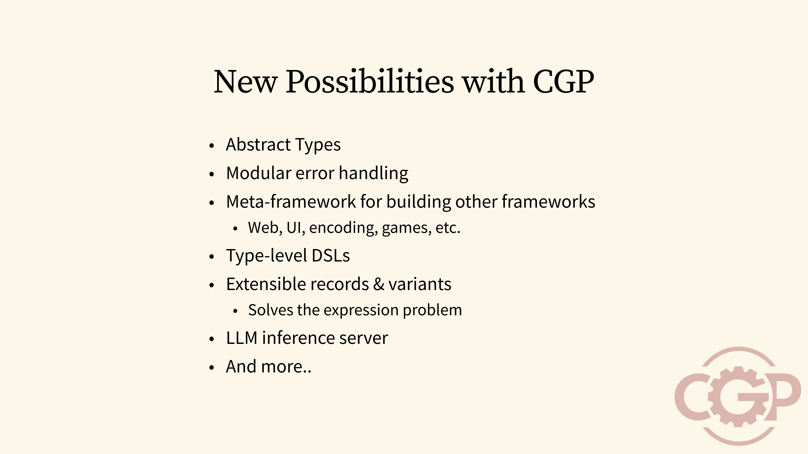

There are many new possibilities that are enabled by CGP, which I unfortunately do not have time to cover them here. But, here is a sneak preview of some of the use cases for CGP. One of the key potentials is to use CGP as a meta-framework to build other kinds of frameworks and DSLs. CGP also extends Rust to support extensible records and variants, which can be used to solve the expression problem. At Tensordyne, we also have some experiments on the use of CGP for LLM inference.

## 63

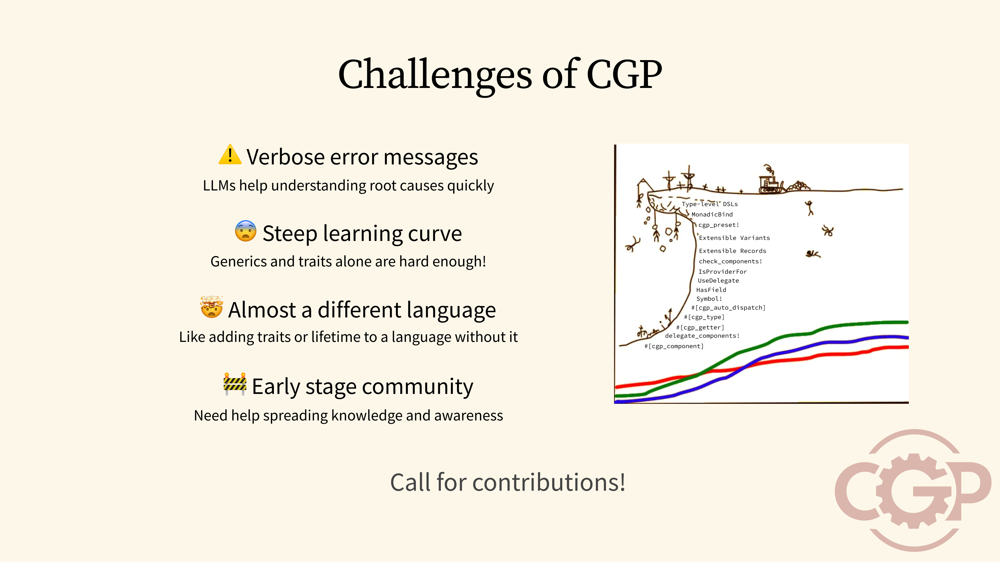

But although it is easy to get started with CGP, there are some challenges I should warn you about before you get started. Because of how the trait system is used, any unsatisfied dependency will result in some very verbose and difficult-to-understand error messages. In the long term, we would need to make changes to the Rust compiler itself to produce better error messages for CGP, but for now, I have found that large language models can be used to help you understand the root cause more quickly. Most importantly, the biggest challenge for CGP is that it has a steep learning curve. Programming in CGP can almost feel like programming in a new language of its own. We are also still in the early stages of development, so the community and ecosystem support may be weak. On the plus side, this means that there are plenty of opportunities for you to get involved, and make CGP better in many ways.

## 64

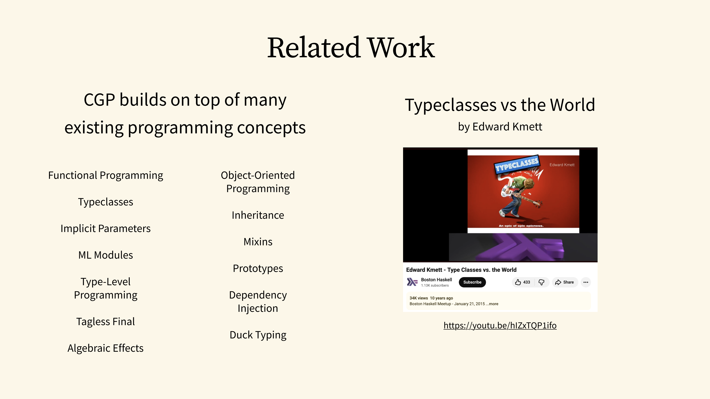

I also want to give credit to the fact that context-generic programming is built on the foundation of many existing programming concepts, both from functional programming and from object-oriented programming. While I don't have time to go through the comparison, if you are interested in learning more, I highly recommend watching the Haskell presentation called "Typeclasses vs. the World" by Edward Kmett. This talk has been one of the core inspirations that has led me to the creation of context-generic programming.

## 65

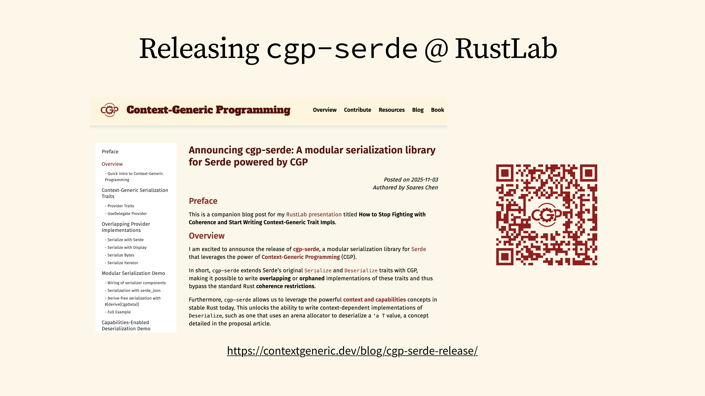

And before we end, I want to share that I am releasing cgp-serde today, with a companion article to this talk. So do check out the blog post after this, and help spread the word on social media.

## 66

Thank you for listening. And if you are interested, do check out our project website to find out more about context-generic programming.
